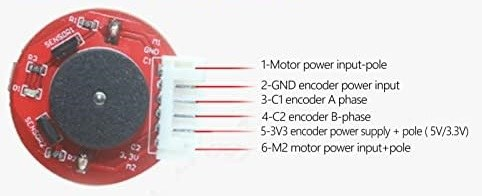
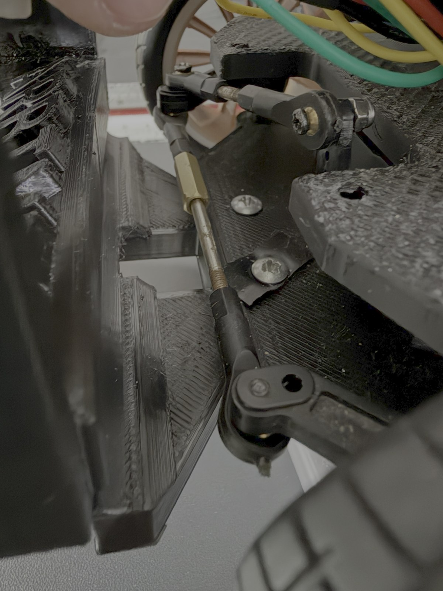

# 01 - Mechanical Design

**Project:** MetallicMadness / ARBIBOT  
**Category:** WRO 2026 Future Engineers - Self-Driving Cars  
**Document purpose:** Explain the mechanical design of the vehicle, including chassis, dimensions, drive axle, steering linkage, motor selection, torque/speed reasoning, and design iterations.

> This document is part of the technical documentation package for the ARBIBOT self-driving car. It focuses only on the mechanical subsystem. Electronics, power, sensors, and software are documented in separate files.

---

## 1. Mechanical Design Goals

ARBIBOT was designed as a compact four-wheel autonomous vehicle for the WRO Future Engineers Self-Driving Cars challenge. The mechanical design had to satisfy several practical goals:

1. Stay inside the WRO size and weight limits.
2. Use a four-wheel vehicle layout with one driving axle and one steering actuator.
3. Provide enough torque to move the robot reliably with the Jetson, STM32, batteries, sensors, and wiring installed.
4. Maintain stable traction on the WRO track surface.
5. Allow accurate steering corrections during lane following, obstacle avoidance, and cornering.
6. Provide physical mounting positions for the Jetson Orin Nano, STM32F411, motor driver, sensors, batteries, camera, and wiring.
7. Keep the robot reproducible using 3D-printed components and commercially available electromechanical parts.

The final design uses a **3D-printed chassis**, **rear-wheel drive**, and **servo-actuated front-wheel steering**. The mechanical system was developed through several iterations, mainly around drive torque, wheel traction, sensor bumper placement, and steering geometry.

---

## 2. WRO Mechanical Compliance Summary

| Requirement / Parameter | ARBIBOT value | WRO limit / expectation | Status |
|---|---:|---:|---|
| Vehicle length | 250 mm | Max. 300 mm | OK |
| Vehicle width | 156 mm | Max. 200 mm | OK |
| Vehicle height | 180 mm | Max. 300 mm | OK |
| Vehicle weight | 1.35 kg | Max. 1.5 kg | OK |
| Wheel count | 4 wheels | 4-wheeled vehicle | OK |
| Drive configuration | Rear-wheel drive | Front, rear, or four-wheel drive allowed | OK |
| Steering actuator | 1 servo | One steering actuator allowed | OK |
| Differential drive | Not used | Differential wheeled base not allowed | OK |
| Omnidirectional / ball wheels | Not used | Not allowed | OK |
| Track width | 135 mm | Must remain within 200 mm total vehicle width | OK |
| Wheel diameter | Not recorded yet | Not specified by WRO | Optional measurement |

The robot remains below the maximum allowed envelope of **300 mm × 200 mm × 300 mm** and below the **1.5 kg** weight limit. The current mechanical margins are:

| Parameter | Margin |
|---|---:|
| Length margin | 50 mm |
| Width margin | 44 mm |
| Height margin | 120 mm |
| Weight margin | 0.15 kg |

These margins are important because the robot carries relatively heavy components, including the Jetson Orin Nano, the motor battery pack, the UPS module, the motor driver, and the 3D-printed sensor bumper.

---

## 3. Chassis Design

The chassis is based on a **custom 3D-printed structure**. The main reason for using a 3D-printed chassis was flexibility: the team needed to mount non-standard components such as the Jetson Orin Nano, STM32F411 Black Pill, Cytron MD10C motor driver, VL53 distance sensors, Pololu servo controller, camera module, battery system, and custom wiring.

The 3D-printed design allowed the team to quickly modify the structure during testing. This was important because several mechanical problems were discovered only after the robot was assembled and tested on the track. For example, the first bumper design rubbed against the tire during steering, and some distance sensors were initially mounted too low to measure the intended wall distance reliably. With a printed structure, the bumper and sensor mounts could be redesigned without rebuilding the entire vehicle.


### 3.1 Main Chassis Functions

The chassis performs five mechanical functions:

1. **Structural support**  
   It holds the drive axle, steering system, electronics, batteries, sensors, and camera.

2. **Component positioning**  
   It places the camera and distance sensors where they can observe the track, walls, pillars, and front obstacles.

3. **Weight distribution**  
   It supports the heavier SBC and batteries while keeping the vehicle stable during acceleration and turning.

4. **Mechanical protection**  
   The bumper and printed frame protect the sensors and internal wiring from direct contact with obstacles or walls.

5. **Iteration support**  
   Because the frame is printed, the team can test, modify, and reprint mechanical parts as the design evolves.

### 3.2 Chassis Tradeoff

A 3D-printed chassis is easy to customize, but it can be less rigid than a metal or carbon fiber chassis. The team accepted this tradeoff because the WRO track is flat, the robot does not need suspension travel, and customization is more important than extreme stiffness. The printed structure also keeps the design reproducible for future teams.

The main design risk is that printed parts can flex or crack around screw holes, steering mounts, or bumper supports. For that reason, the team reinforced the steering and bumper areas and used screws for mechanical adjustment where alignment is critical.

---

## 4. Vehicle Dimensions and Layout

| Parameter | Value |
|---|---:|
| Length | 25.0 cm |
| Width | 15.6 cm |
| Height | 18.0 cm |
| Weight | 1.35 kg |
| Wheelbase | 13.9 cm |
| Track width | 13.5 cm, center-to-center between left and right wheels |
| Drive axle | Rear axle |
| Steering axle | Front axle |
| Chassis type | 3D printed |

The wheelbase of **13.9 cm** was selected to keep the vehicle short enough for the WRO starting zones while still providing enough stability for straight driving. A shorter wheelbase improves turning ability, but if it becomes too short the vehicle can become unstable and sensitive to steering changes. A longer wheelbase improves straight-line stability, but it can make cornering and parking more difficult.

The current wheelbase is a compromise between:

- cornering ability,
- lane stability,
- space for electronics,
- space for battery placement,
- mechanical room for the steering linkage,
- and WRO size constraints.

---

## 5. Drive Configuration

ARBIBOT uses **rear-wheel drive**. The rear axle is powered by a DC gear motor with encoder feedback. The front wheels are used for steering.

Rear-wheel drive was selected because it provides a simple and legal drivetrain layout for WRO. It avoids the prohibited differential-drive style where each side of the vehicle is driven independently. In ARBIBOT, steering is handled mechanically by the front steering linkage, and forward/reverse movement is handled by the rear drive system.

### 5.1 Why Rear-Wheel Drive Was Selected

Rear-wheel drive provides several advantages for this robot:

1. **Mechanical simplicity**  
   Only one main drive motor is required for propulsion.

2. **Compliance with WRO rules**  
   The robot uses a car-like layout instead of differential steering.

3. **Better separation of functions**  
   The rear axle handles propulsion while the front axle handles steering.

4. **Predictable control**  
   The Jetson and STM32 can control speed and steering as separate actions.

5. **Compatibility with encoder feedback**  
   The motor encoder can be used to estimate motor rotation, RPM, and movement by degrees.

### 5.2 Drive Axle Design

The drive axle is powered through the rear drivetrain. The motor is a **JGY-370B 12V worm gear motor with encoder**, selected for its low-speed torque and integrated feedback.

The previous drivetrain design used a single-shaft motor setup with a gearbox and connected rear wheels. During testing, this version had significant torque-transfer problems between the gearbox gear and the wheel gear. This made the robot unreliable under load. The final design moved toward a stronger motor/encoder configuration to improve movement consistency and control feedback.

---

## 6. Drive Motor

The drive motor is a **JGY-370B 12V Mini Worm Gear Motor with Encoder**, configured for approximately **150 RPM** no-load output speed.

| Motor parameter | Value |
|---|---|
| Motor type | DC worm gear motor with encoder |
| Model | JGY-370B |
| Rated voltage | 12 V DC |
| No-load speed | 150 RPM |
| Shaft type | D-type shaft |
| Gear material | Metal gears |
| Encoder type | Hall-effect quadrature encoder |
| Encoder phases | A/B square-wave output |
| Encoder base resolution | 11 PPR at motor shaft |
| Encoder voltage | 3.3 V / 5 V |
| Direction | CW / CCW reversible |



### 6.1 Reason for Selecting a Worm Gear Motor

The worm gear motor was selected because the robot requires controlled low-speed movement more than high speed. WRO driving is not a drag race; the robot must complete laps autonomously, avoid walls, obey traffic signs, and park. A fast but unstable robot is just a very confident crash machine.

The worm gear motor provides:

- high torque at low speed,
- compact size,
- metal gearing,
- controlled motion,
- encoder feedback,
- and self-locking behavior when power is removed.

The self-locking characteristic is useful because the motor shaft resists unwanted movement when the motor is not powered. This can help the vehicle remain stable during stop conditions, although it also means the drivetrain may have more resistance than a free-spinning gear motor.

---

## 7. Speed Reasoning

The motor speed is **150 RPM** at the gearbox output under no-load conditions. The theoretical linear speed depends on the wheel diameter.

The estimated vehicle speed can be calculated using:

```text
wheel_circumference = pi × wheel_diameter

linear_speed = wheel_circumference × wheel_RPM / 60
```

Because the exact wheel diameter still needs to be measured, the final speed estimate is left as a calculation template:

```text
wheel_diameter = not recorded yet
wheel_RPM = 150 RPM no-load

linear_speed = pi × wheel_diameter × 150 / 60
```

Example table to complete after wheel diameter measurement:

| Wheel diameter | Estimated no-load speed |
|---:|---:|
| Not recorded yet | Not calculated because wheel diameter was not recorded |
| Not recorded yet | Not calculated because wheel diameter was not recorded |

The actual driving speed will be lower than the no-load calculation because the robot carries approximately **1.35 kg**, and because acceleration, steering friction, floor contact, battery voltage, and PWM speed limits reduce real movement speed.

### 7.1 Speed Tradeoff

The team selected a 150 RPM motor because it is slow enough to control accurately but fast enough to complete the track within the WRO time limit. A higher-RPM motor could reduce lap time, but it would increase overshoot, make corners harder to control, and reduce obstacle-avoidance stability. A lower-RPM motor would be easier to control but could make the robot too slow during the three-minute challenge window.

The selected motor is therefore a compromise between:

- speed,
- torque,
- steering stability,
- obstacle reaction time,
- and repeatability.

---

## 8. Torque Reasoning

Torque is important because ARBIBOT weighs approximately **1.35 kg** and must accelerate from rest, overcome rolling resistance, and continue moving while turning.

The motor supplier specification indicates a rated torque range depending on gearbox configuration, with a stall torque range higher than the rated torque. Because the exact gearbox torque table for the selected 150 RPM configuration must be confirmed, the team treats the published torque range as a reference and validates the drivetrain through physical testing.

The force available at the wheel can be estimated using:

```text
wheel_force = wheel_torque / wheel_radius
```

And wheel torque can be approximated from motor output torque:

```text
wheel_torque ≈ motor_output_torque × drivetrain_efficiency
```

To complete the final calculation, the following values should be measured or confirmed:

| Parameter | Value |
|---|---:|
| Motor output torque at 150 RPM | Not recorded from final supplier table; drivetrain validated through physical tests |
| Wheel radius | Not recorded yet |
| Drivetrain efficiency | Not recorded; worm gear losses expected |
| Estimated wheel force | Not calculated; practical torque validated by test driving |

### 8.1 Practical Torque Validation

During testing, the first drivetrain design had difficulty transferring torque reliably from the gearbox to the rear wheels. This was a real-world failure mode that mattered more than the theoretical motor rating. The issue showed that torque is not only about the motor; it is also about how torque is transferred through gears, shafts, couplers, and wheels.

The final design improved drivetrain reliability by using the selected JGY-370B motor with encoder feedback and a more controlled rear drive layout.

---

## 9. Encoder and Odometry Role

The drive motor includes a Hall-effect quadrature encoder. The encoder provides two output channels, phase A and phase B, which allow the STM32 to count pulses and determine rotation direction.

| Encoder parameter | Value |
|---|---|
| Encoder type | Hall-effect quadrature |
| Output phases | A and B |
| Base pulse count | 11 PPR |
| Output signal | Square wave |
| Voltage | 3.3 V / 5 V |
| Interface | PH 2.0 connector |
| MCU connection | STM32 GPIO / interrupt input |

The encoder is used for:

1. **Move-by-degrees commands**  
   The STM32 converts requested motor degrees into encoder counts.

2. **RPM estimation**  
   Encoder count change over time is used to estimate motor speed.

3. **Movement repeatability**  
   Encoder feedback helps make motor movements more consistent than timing-only control.

The encoder is not currently used as the primary corner-detection method. Corner timing is handled by camera and distance sensor logic, while turning behavior is mainly controlled by timed steering and motor commands.

---

## 10. Steering Mechanism

ARBIBOT uses a **servo-actuated pushrod steering mechanism with a tie-rod linkage between both front wheels**.



The steering servo moves a servo arm. The servo arm pushes and pulls a linkage connected to the right front steering knuckle. The left and right steering knuckles are connected by a tie rod, so both front wheels turn together.

The mechanism can be described as:

```text
servo → servo arm → pushrod → right steering knuckle → tie rod → left steering knuckle
```

This is a **custom pushrod/tie-rod front steering linkage**. It is Ackermann-inspired because the front wheels are connected mechanically through steering arms and a tie rod, but the team does not claim true Ackermann geometry until steering angles are measured and verified.

### 10.1 Steering Actuator

| Steering parameter | Value |
|---|---|
| Servo model | MG996R |
| Operating voltage | 5 V |
| Rated torque | 9.4 kg·cm at 4.8 V |
| Control method | Pololu servo controller |
| Steering type | Front-wheel steering |
| Linkage type | Pushrod + tie rod |

The MG996R servo was selected because it provides enough torque for the front steering system while remaining compact and easy to control. The servo does not directly rotate the wheels; it actuates the linkage, which transfers motion mechanically to both front wheels.

### 10.2 Servo Torque Conversion

The servo torque rating is given as **9.4 kg·cm**. This can be converted approximately to Newton-meters:

```text
1 kgf·cm ≈ 0.0981 N·m

9.4 kgf·cm × 0.0981 ≈ 0.92 N·m
```

This torque is adequate for steering a lightweight 1.35 kg robot on a flat WRO field, assuming the linkage has low friction and the wheels are not jammed against the wall or bumper.

### 10.3 Steering Linkage Tuning

During mechanical development, the team adjusted:

- the linkage rod lengths,
- the servo arm size,
- the pushrod connection point,
- and the front-wheel alignment screw.

These adjustments were necessary to achieve a usable turning range without excessive mechanical stress. The final steering alignment uses a screw adjustment to fine-tune the front-wheel angle.

The main steering design goals were:

1. enough steering angle to complete WRO corners,
2. stable straight-line movement,
3. minimal mechanical play,
4. no tire rubbing against the bumper,
5. and repeatable steering response from the servo.

### 10.4 Steering Tradeoff

A longer servo arm increases steering range but reduces effective force and can make steering more sensitive. A shorter servo arm increases force and precision but may not turn the wheels enough. The team adjusted the servo arm and linkage rods to find a usable compromise between turning radius and steering stability.

---

## 11. Wheel and Traction Design

The robot was tested with thinner wheels, but they slid on the track. This reduced reliability because the controller could command a turn, but the physical vehicle would not always follow the expected path.

The final design uses wider rubber tires with more contact area. This improved grip and made steering and acceleration more predictable.

### 11.1 Wheel Tradeoff

| Wheel option | Result |
|---|---|
| Thinner wheels | Lower contact area; slipped on the track |
| Wider rubber wheels | Better traction and more stable steering |
| Very soft tires | Not used in the final documented configuration |
| Very hard tires | Not used in the final documented configuration |

The selected wheels improve reliability, but they may increase rolling resistance. The team accepted this because reliable wall-following and obstacle avoidance are more important than maximum speed.

### 11.2 Remaining Wheel Measurements

The following values should be added after final measurement:

| Measurement | Value |
|---|---:|
| Wheel diameter | Not recorded yet |
| Wheel width | 2.5 cm |
| Track width | 13.5 cm |
| Minimum turning radius | Not recorded yet |
| Maximum left steering angle | Not recorded yet |
| Maximum right steering angle | Not recorded yet |

---

## 12. Sensor Bumper Mechanical Design

The front bumper holds the front distance sensors and helps protect them. The bumper went through several versions.

The first bumper design rubbed against the tire when the wheels turned. This created mechanical interference and affected steering reliability. The team redesigned the bumper and repositioned the sensors so that the tires could turn freely.

The sensors were also originally mounted too low. This caused unreliable distance readings because the sensors were not always measuring the intended wall or obstacle surface. The team repositioned the sensors to improve the measurement angle and distance reliability.

### 12.1 Bumper Design Goals

The bumper must:

1. hold the front VL53L8CH sensor,
2. hold the left and front-right VL53L4CD sensors,
3. avoid rubbing against the front tires,
4. keep sensors aligned with the expected wall/obstacle height,
5. protect wiring,
6. and remain inside the WRO vehicle size limit.

### 12.2 Sensor-Mount Tradeoff

Low-mounted sensors can detect close obstacles but may read the floor, bumper edges, or wheel shadows. Higher sensors may be cleaner but can miss low objects or change the measured geometry. The final sensor height was selected based on test readings at fixed distances.

---

## 13. Design Iterations

The mechanical design evolved through testing. The main iterations are summarized below.

| Area | Initial approach | Problem found | Final improvement |
|---|---|---|---|
| Drive motor | Motor without encoder | No direct feedback for movement control | Encoder motor selected |
| Rear drivetrain | Single-shaft motor with gearbox and connected rear wheels | Torque-transfer issues between gearbox gear and wheel gear | Stronger rear-drive configuration with encoder feedback |
| Wheels | Thinner wheels | Slid on the track | Wider tires with better traction |
| Distance sensing | Ultrasonic sensors | Lower precision and less reliable readings | VL53 laser time-of-flight sensors |
| Front bumper | First printed bumper | Rubbed against tire during turns | Bumper redesigned and sensor position adjusted |
| Sensor height | Sensors mounted too low | Distance readings were less reliable | Sensors repositioned to better measure walls/obstacles |
| Steering linkage | Early linkage geometry | Turning range and alignment needed tuning | Rod lengths, servo arm size, and alignment screw adjusted |

These iterations show that the final robot was not only assembled; it was improved through repeated testing and design correction.

---

## 14. Mechanical Failure Modes and Mitigation

| Failure mode | Cause | Mitigation |
|---|---|---|
| Tire rubbing against bumper | Bumper too close to steering path | Redesign bumper clearance |
| Wheel slip | Thin wheels / low traction | Use wider rubber tires |
| Poor torque transfer | Gearbox-to-wheel coupling issue | Change motor/drivetrain configuration |
| Steering not centered | Linkage length and servo neutral offset | Use mechanical adjustment screw and servo calibration |
| Excessive steering sensitivity | Servo arm too long or linkage geometry too aggressive | Adjust servo arm and linkage rod length |
| Sensor reading instability | Sensors too low or poorly aligned | Reposition sensor mounts |
| Chassis flex | 3D-printed structure under load | Reinforce mounting points and reduce unsupported spans |
| High center of gravity | Jetson and electronics mounted above chassis | Keep batteries and heavier components low where possible |

---

## 15. Reproducibility Notes

To reproduce the mechanical design, another team should prepare:

1. 3D-printed chassis and bumper parts.
2. Four wheels with sufficient grip for the WRO mat.
3. JGY-370B 12V 150 RPM worm gear motor with encoder.
4. MG996R steering servo.
5. Pushrod and tie-rod linkage hardware.
6. Mounting screws, nuts, spacers, and alignment hardware.
7. Sensor brackets for VL53L4CD and VL53L8CH sensors.
8. Electronics mounting points for Jetson, STM32, motor driver, servo controller, batteries, and wiring.

Recommended CAD files to include in the repository:

```text
models/cad/chassis.step
models/cad/front-bumper.stl
models/cad/sensor-mount-left-vl53l4cd.stl
models/cad/sensor-mount-right-vl53l4cd.stl
models/cad/front-vl53l8ch-mount.stl
models/cad/jetson-mount.stl
models/cad/stm32-mount.stl
models/cad/battery-holder.stl
models/drawings/vehicle-top-dimensions.pdf
models/drawings/vehicle-side-dimensions.pdf
```

---

## 16. Pending Measurements

The following values should be measured and added before final submission:

| Pending item | Reason |
|---|---|
| Track width | Required for a complete dimensioned mechanical description |
| Wheel diameter | Needed for speed calculation |
| Wheel width | Helps explain traction choice |
| Minimum turning radius | Important for cornering and parking explanation |
| Maximum steering angle left/right | Shows steering capability |
| Actual loaded speed at 50%, 75%, 100% PWM | Validates speed reasoning |
| Motor current under load | Connects mechanical load to power budget |
| Drive axle connection photo | Improves reproducibility |
| Full top-view steering photo with arrows | Makes linkage easier for judges to understand |

---

## 17. Conclusion

The mechanical design of ARBIBOT uses a compact 3D-printed chassis, rear-wheel drive, a 12V worm gear motor with encoder feedback, and a servo-actuated pushrod/tie-rod front steering system. The final design was selected after testing several alternatives, including a motor without encoder, thinner wheels, ultrasonic sensors, early bumper layouts, and different steering linkage settings.

The strongest mechanical decisions were:

- using a 3D-printed structure for fast iteration,
- selecting rear-wheel drive for WRO compliance and control simplicity,
- using a worm gear motor for torque and controlled low-speed motion,
- adding encoder feedback for repeatable movement,
- using wider wheels to improve traction,
- and tuning the steering linkage mechanically to improve turning range and alignment.

The remaining work is to complete exact measurements for wheel diameter, track width, turning radius, and steering angle. Once these values are added, this document will provide a strong and reproducible mechanical design explanation for WRO evaluation.
