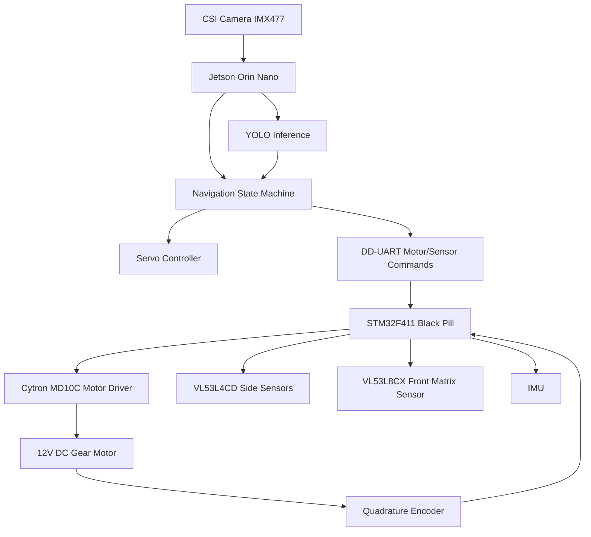
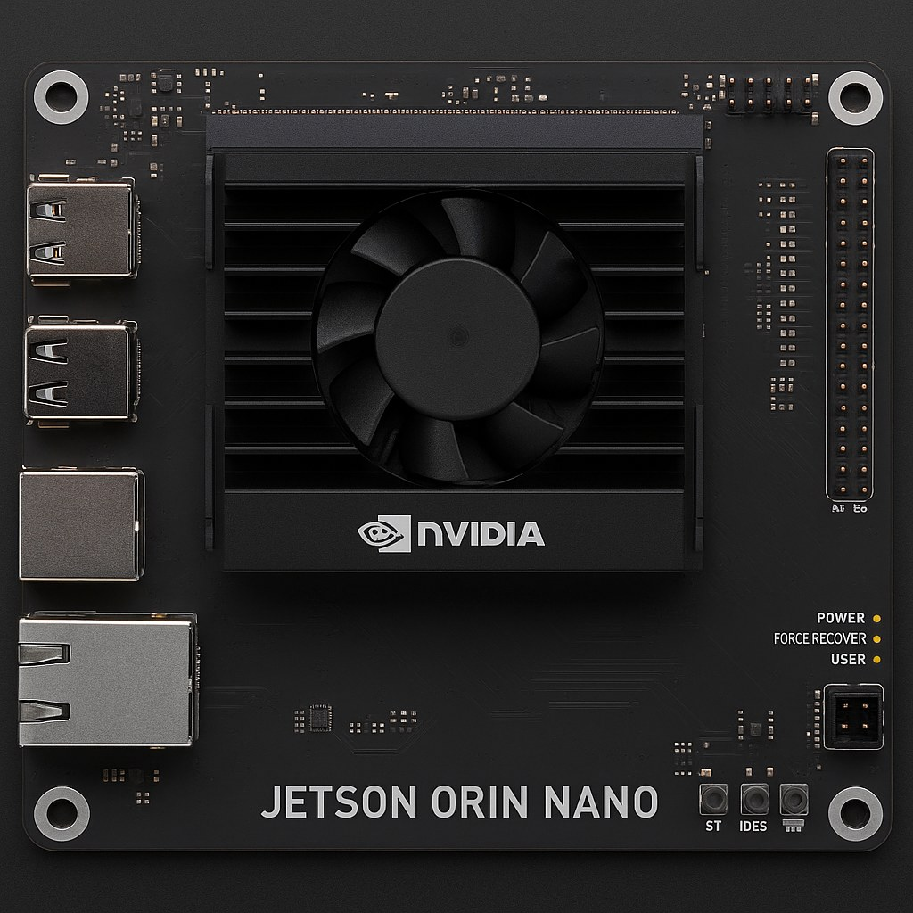
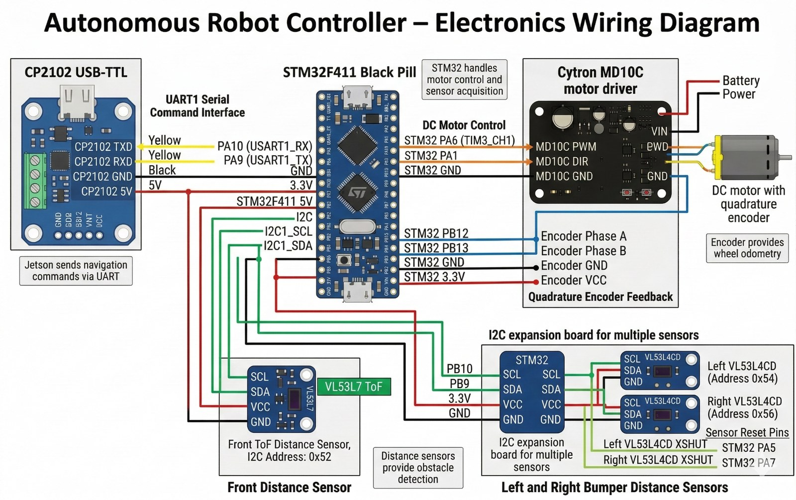
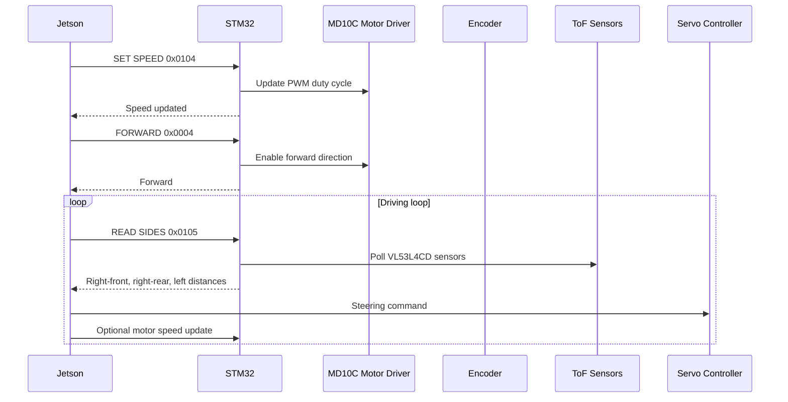
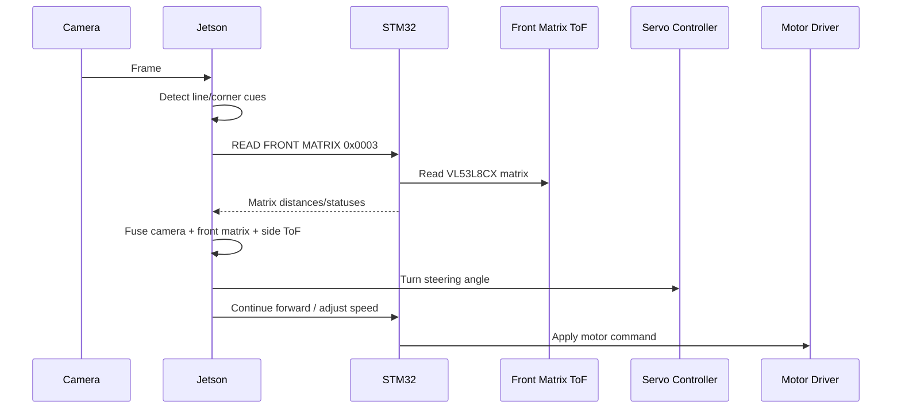
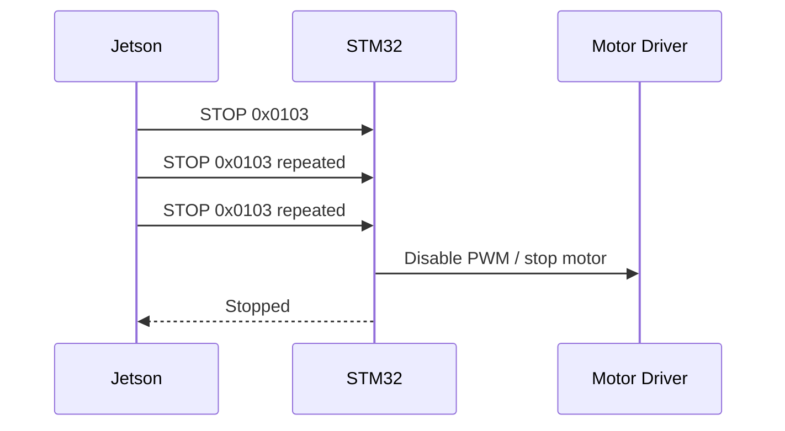
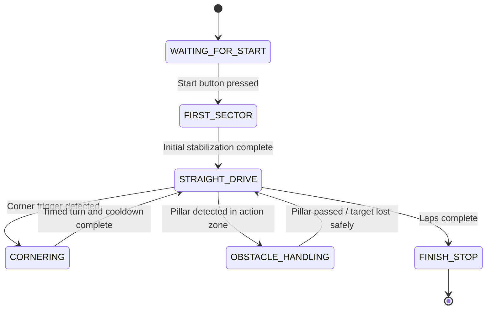

# 03 - Software Architecture

**Project:** MetallicMadness / ARBIBOT  
**Category:** WRO 2026 Future Engineers - Self-Driving Cars  
**Document purpose:** Explain the software architecture of ARBIBOT, including the Jetson/STM32 split, main modules, state machine, command flow, DD-UART protocol, sensor/motor coordination, and challenge behavior.

> This document is part of the ARBIBOT technical documentation package. It focuses on software structure and system behavior. Mechanical design, power, and sensor hardware are documented separately.

---

## 1. Software Design Goals

The ARBIBOT software was designed to solve the WRO Future Engineers Self-Driving Cars challenge using a two-controller architecture:

1. **NVIDIA Jetson Orin Nano**  
   Runs the high-level intelligence: camera capture, YOLO inference, obstacle recognition, corner/line detection, navigation logic, steering decisions, and challenge state management.

2. **STM32F411 Black Pill**  
   Runs the low-level real-time control: motor PWM, motor direction, encoder reading, distance sensor polling, IMU acquisition, and binary serial command handling.

This separation allows each controller to do what it is good at. The Jetson handles heavy AI and vision work. The STM32 handles timing-sensitive hardware tasks. In short: Jetson thinks, STM32 reacts. That division keeps the robot from trying to do deep learning and real-time I2C babysitting in the same brain cell.

---

## 2. High-Level System Architecture







The Jetson and STM32 communicate through a custom binary serial protocol called **DD-UART**. The Jetson sends commands such as motor speed, forward, stop, and sensor read requests. The STM32 replies with text payloads inside binary response frames.

---

## 3. Controller Responsibilities

### 3.1 NVIDIA Jetson Orin Nano Responsibilities

The Jetson Orin Nano is the high-level decision controller.

| Jetson responsibility | Description |
|---|---|
| Camera capture | Captures frames from the CSI camera using GStreamer and OpenCV |
| YOLO inference | Runs custom-trained Ultralytics YOLO models |
| Pillar recognition | Detects and classifies red and green traffic signs |
| Line/corner recognition | Detects blue/orange track lines and corner cues |
| Lane decision logic | Uses sensor feedback and PID/PDI controllers |
| State machine | Manages challenge phases and transitions |
| Motor command generation | Sends DD-UART commands to the STM32 |
| Steering control | Commands steering through the Pololu servo controller |
| Sensor polling coordination | Reads side and front distance data through STM32 responses |
| Headless operation | Runs without GUI during robot operation |

The Jetson does not directly drive the motor or poll every low-level sensor itself. It sends commands and receives interpreted sensor values from the STM32. This makes the high-level code cleaner and reduces timing problems.

### 3.2 STM32F411 Responsibilities

The STM32F411 is the low-level real-time controller.

| STM32 responsibility | Description |
|---|---|
| DD-UART parsing | Receives binary frames, validates checksum, dispatches commands |
| Motor control | Controls PWM and direction signals to Cytron MD10C |
| Motor speed setting | Updates PWM duty cycle based on speed percentage |
| Move-by-degrees | Uses encoder counts to move a requested motor rotation |
| Encoder reading | Reads quadrature encoder phase A/B |
| RPM calculation | Calculates speed from encoder counts over time |
| VL53L4CD polling | Reads left, right-front, and right-rear ToF sensors |
| VL53L8CX matrix polling | Reads front matrix distance sensor |
| IMU acquisition | Reads gyroscope and accelerometer data |
| Response framing | Sends status/sensor responses back to Jetson |

The STM32 keeps direct control of the peripherals that require deterministic timing or low-level bus access.

---

## 4. Main Jetson Software Modules

The Jetson software is organized into challenge scripts, perception modules, control modules, and hardware communication modules.

| File | Role |
|---|---|
| `main_challenge_01_v4.py` | Current Open Challenge controller: camera-corner detection, heading wall-follow, front-matrix corner trigger |
| `main_challenge_02.py` | Current Obstacle Challenge controller: pillar YOLO and PDI pass-side steering |
| `turn_models.py` | CornerDetector module for line/corner YOLO detection and result drawing |
| `Pillar_recognition.py` | Converts YOLO output into structured pillar detections: color, zone, area, nearest pillar, guidance |
| `pillar_counter.py` | Debounced enter/exit counting per pillar color |
| `pid_line_follower.py` | PID lane controller using difference and single-wall modes |
| `sensor_distance_v3.py` | Reads/parses side ToF and front matrix responses from STM32 |
| `motor_driver.py` | Sends DD-UART motor commands to STM32 |
| `servo_controller.py` | Controls steering servo through serial interface |
| `color_tuning.py` | Applies per-camera color correction for detection stability |

### 4.1 Open Challenge Main Script

`main_challenge_01_v4.py` is the current Open Challenge control script. Its purpose is to complete three laps without traffic signs. It combines:

- camera-based corner/line recognition,
- side ToF wall following,
- right-front/right-rear heading correction,
- front matrix corner trigger,
- motor speed control,
- steering servo control,
- and state transitions.

### 4.2 Obstacle Challenge Main Script

`main_challenge_02.py` is the current Obstacle Challenge control script. Its purpose is to drive the track while obeying red/green traffic signs and eventually supporting parking strategy. It combines:

- YOLO pillar detection,
- pass-side logic,
- PDI steering correction,
- side ToF wall following,
- pillar debounce/counting,
- and motor/steering command coordination.

---

## 5. Main STM32 Software Modules

The STM32 firmware is organized around protocol handling, motor control, sensor drivers, and platform/I2C support.

| File | Role |
|---|---|
| `main.c` | Main loop and command dispatch |
| `serial_dd_protocol.c/.h` | DD-UART frame parsing, checksum validation, command dispatch, response generation |
| `motor_drv.c/.h` | PWM, direction, set-speed, move-by-degrees, encoder count, RPM |
| `sensor_vl53l4cd.c` | VL53L4CD side sensor management |
| `sensor_vl53l7ch.c` / `sensor_vl53l8ch.c` | Front matrix ToF sensor management; filenames may reflect earlier VL53L7/L8 iterations |
| `sensor_imu.c` | IMU gyro/accelerometer acquisition |
| `platform.c` / `platform2.c` | I2C platform layer for ToF sensors |
| `platformL8.c` | Platform abstraction for VL53L8/front matrix sensor |
| `protocolL8.c` | Front matrix sensor communication helpers |

### 5.1 Firmware Design Strategy

The STM32 firmware acts as a command server. It waits for frames from the Jetson, validates the frame, executes the requested command, and sends a response. This approach keeps the hardware side predictable and easy to debug.

The STM32 does not decide how to navigate the field. It only provides accurate low-level actions and measurements. Navigation decisions remain on the Jetson.

---

## 6. DD-UART Protocol

The Jetson and STM32 communicate using a custom binary serial protocol called **DD-UART**.

### 6.1 Frame Format

```text
$  LEN(2 bytes, big-endian)  CMD(2 bytes, big-endian)  DATA(0..n)  CHK(1 byte)  \n
```

| Field | Size | Description |
|---|---:|---|
| START | 1 byte | ASCII `$` |
| LEN | 2 bytes | Total frame length in bytes, big-endian |
| CMD | 2 bytes | Command ID, big-endian |
| DATA | 0..n bytes | Optional payload |
| CHK | 1 byte | XOR checksum |
| END | 1 byte | Newline `\n` |

The checksum is calculated as XOR over every byte between START and checksum, meaning:

```text
CHK = XOR(LEN bytes + CMD bytes + DATA bytes)
```

Responses use the same frame structure and usually include ASCII-text payloads.

### 6.2 Example Frames

#### STOP command

Command: `0x0103`, no payload.

```text
24 00 07 01 03 05 0A
```

Explanation:

| Byte(s) | Meaning |
|---|---|
| `24` | `$` start byte |
| `00 07` | frame length = 7 |
| `01 03` | command = STOP |
| `05` | checksum |
| `0A` | newline end byte |

#### SET SPEED 80%

Command: `0x0104`, payload `0x50` = decimal 80.

```text
24 00 08 01 04 50 5D 0A
```

---

## 7. DD-UART Command List

| CMD | Name | Payload | Response |
|---:|---|---|---|
| `0x0001` | READ_GYRO | None | IMU gyroscope data |
| `0x0002` | READ_ACCEL | None | IMU accelerometer data |
| `0x0003` | READ_FRONT | None | Front VL53L7/L8 matrix text: distances/statuses |
| `0x0004` | FORWARD continuous | None | `Forward` |
| `0x0005` | REVERSE continuous | None | `Reverse` |
| `0x0101` | FORWARD by degrees | `uint16 LE degrees` | Acknowledgement |
| `0x0102` | REVERSE by degrees | `uint16 LE degrees` | Acknowledgement |
| `0x0103` | STOP | None | `Stopped` |
| `0x0104` | SET SPEED | `uint8 percent` from 0 to 100 | `Speed updated` |
| `0x0105` | READ SIDES | None | `RIGHT_FRONT: a mm | RIGHT_REAR: b mm | LEFT: c mm` |

Most-used commands during driving:

```text
0x0104  SET SPEED
0x0004  FORWARD continuous
0x0103  STOP
0x0105  READ SIDES
0x0003  READ FRONT MATRIX
```

---

## 8. Command Flow

### 8.1 Normal Driving Command Flow



### 8.2 Corner Detection Command Flow



### 8.3 Stop Command Flow

The STOP command is safety-critical. During early testing, stop frames could be dropped when the serial link was busy with matrix scans. The current strategy pulses critical commands several times.



---

## 9. Serial Bus Coordination

The motor and sensors share one serial command link between Jetson and STM32. This created an important software design constraint: two different Jetson threads must not read from the same serial port at the same time.

### 9.1 Problem

Early tests showed that if the sensor thread and motor command code both waited for responses from the STM32, they could fight over the serial bus. This caused:

- delayed sensor updates,
- missed motor responses,
- dropped stop commands,
- blocked vision logic,
- and motor commands not executing when the camera loop was busy.

### 9.2 Solution

The final approach is:

1. The sensor thread owns all serial reads.
2. Sensor polling is continuous but controlled.
3. Motor commands are sent fire-and-forget when possible.
4. Critical commands such as FORWARD and STOP are pulsed several times.
5. Matrix sensor polling is kept off until needed because it is heavier than side sensor polling.

This improves real-time behavior because the robot does not block its vision loop waiting for every motor acknowledgement.

---

## 10. Software State Machine

ARBIBOT uses a state machine to organize behavior. Each state has a specific purpose and clear transition conditions.



### 10.1 State Descriptions

| State | Purpose |
|---|---|
| `WAITING_FOR_START` | Robot is powered and ready, but not moving until the start button is pressed |
| `FIRST_SECTOR` | Initial straight section after start; stabilizes movement and avoids overcorrecting too early |
| `STRAIGHT_DRIVE` | Main driving mode using wall-following, sensor polling, and corner/pillar monitoring |
| `CORNERING` | Open-loop timed turn with blind cooldown to prevent double-triggering |
| `OBSTACLE_HANDLING` | Active red/green pillar pass-side steering using YOLO and PDI control |
| `FINISH_STOP` | Stop condition after completed laps or challenge end |

### 10.2 Why a State Machine Is Used

A state machine prevents the robot from applying all behaviors at once. For example, the robot should not perform wall-following, corner turning, and obstacle avoidance with equal priority at the same time. That would be software soup, and soup is not a control strategy.

The state machine gives priority to the behavior required by the current situation:

- Before start: wait.
- On straight track: wall-follow.
- Near corner: turn.
- Near pillar: pass on the correct side.
- At finish: stop.

---

## 11. Open Challenge Strategy

The Open Challenge has no red or green traffic signs. The goal is to complete three laps autonomously as quickly and reliably as possible.

### 11.1 Main Inputs

| Input | Use |
|---|---|
| Camera line/corner model | Detect blue/orange track line and corner direction cues |
| Right-front VL53L4CD | Wall distance |
| Right-rear VL53L4CD | Heading relative to wall |
| Front VL53L8CX matrix | Front barrier/corner trigger |
| Encoder | Motor speed/distance feedback on STM32 |

### 11.2 Wall-Following Logic

The robot uses the right-front and right-rear distance sensors to estimate distance and heading.

```text
distance_error = target_right_distance - average(right_front, right_rear)
heading_error = right_front - right_rear
steering_command = Kd * distance_error + Kh * heading_error
```

This allows the robot to stay near a target gap while also remaining parallel to the wall.

### 11.3 Corner Detection

Corner detection combines three cues:

1. **Camera line/corner detection**  
   Detects blue/orange line patterns and helps determine direction.

2. **Front VL53L8CX matrix**  
   Detects approaching front wall or barrier.

3. **Right-wall-collapse fallback**  
   Detects sudden changes in side wall geometry.

The current front matrix corner trigger uses a safer rule than early versions: it avoids using one isolated cell as proof of a wall and requires multiple valid in-band cells.

### 11.4 Cornering Behavior

When a corner is detected:

1. The robot enters `CORNERING`.
2. Steering is commanded in the required direction.
3. The motor continues forward at the selected speed.
4. A timed turn is executed.
5. A blind/cooldown period prevents the same corner from triggering multiple times.
6. The robot returns to `STRAIGHT_DRIVE`.

---

## 12. Obstacle Challenge Strategy

The Obstacle Challenge adds red and green traffic signs. The rules require:

- red pillar: pass on the right,
- green pillar: pass on the left.

The robot uses a YOLO pillar model to classify the traffic sign and estimate its position in the camera frame.

### 12.1 Pillar Detection

The YOLO pillar model detects:

| Class | Meaning |
|---|---|
| `Red_Pillar` | Traffic sign that must be passed on the right |
| `Green_Pillar` | Traffic sign that must be passed on the left |

For each detection, the Jetson calculates:

- bounding box center X,
- bounding box area,
- class/color,
- confidence,
- and screen zone: left, center, or right third.

The nearest pillar is estimated as the detection with the largest bounding box area.

### 12.2 Pass-Side Logic

| Pillar color | Required pass side | Software behavior |
|---|---|---|
| Red | Pass on the right | Steer so the robot path keeps the red pillar to the robot's left side and passes to its right |
| Green | Pass on the left | Steer so the robot path keeps the green pillar to the robot's right side and passes to its left |

The controller compares the pillar's near edge or center position against the target screen zone and applies steering correction.

### 12.3 PDI Obstacle Steering

The Obstacle Challenge uses a PDI-style controller for pillar pass-side steering.

```text
error = target_pass_position - measured_pillar_position
derivative = error - previous_error
integral = accumulated_error

control = Kp * error + Ki * integral + Kd * derivative
```

The current implementation emphasizes proportional and derivative behavior to respond quickly without full-lock steering. During testing, early gains were too aggressive, causing steering saturation and target loss. The gains were softened and the action zone was moved earlier so the robot reacts before the pillar is too close.

---

## 13. YOLO Vision Pipeline

The Jetson uses Ultralytics YOLO models for visual perception.

### 13.1 Camera Pipeline

| Parameter | Value |
|---|---|
| Camera | Mini 12.3MP HQ Camera compatible with Jetson |
| Sensor | Sony IMX477 |
| Interface | CSI / MIPI CSI-2 |
| Capture backend | GStreamer `nvarguscamerasrc` |
| Processing library | OpenCV |
| Working resolution | 1280 × 720 |

### 13.2 YOLO Models

| Model | Purpose | Classes |
|---|---|---|
| Pillar model | Detect traffic signs | `Green_Pillar`, `Red_Pillar` |
| Line/corner model | Detect track/corner line cues | `Blue_line`, `Orange_line` |

### 13.3 Why YOLO Is Used

Color thresholding alone is sensitive to lighting, shadows, reflections, and camera exposure. YOLO provides both classification and localization. This is especially useful for the Obstacle Challenge because the robot must identify not only that an object exists, but whether it is red or green and where it is located in the image.

The vision output is used for:

- detecting pillar color,
- selecting the nearest pillar,
- computing steering error,
- identifying screen zones,
- detecting corner line cues,
- and deciding state transitions.

### 13.4 Pending Vision Metrics

The following metrics should be measured and added:

| Metric | Value |
|---|---|
| YOLO version | Ultralytics YOLO11n |
| Pillar dataset size | 100 images |
| Line/corner dataset size | 180 images |
| Annotation tool | Roboflow |
| Training environment | PC/GPU environment; Jetson used for inference only |
| Inference FPS on Jetson | Approximately 60 FPS |
| Inference time per frame | Approximately 16.7 ms/frame at 60 FPS |
| Pillar confidence threshold | 0.30 |
| Corner line confidence threshold | 0.48 |

---

## 14. Sensor Data Pipeline

The STM32 polls the ToF sensors and sends parsed results to the Jetson.

### 14.1 Side Sensor Response

The side sensor command returns:

```text
RIGHT_FRONT: a mm | RIGHT_REAR: b mm | LEFT: c mm
```

The Jetson parser extracts the three values and stores them in the sensor manager.

### 14.2 Front Matrix Response

The front matrix command returns text blocks such as:

```text
Distances:
...
Statuses:
...
```

The Jetson parser extracts distance and status values. Invalid or out-of-range values are filtered. The front matrix is then reduced to a usable front barrier distance.

### 14.3 Sensor Frequency

| Sensor group | Intended use | Polling style |
|---|---|---|
| Side VL53L4CD sensors | Continuous wall-following | ~20-25 Hz target |
| Front matrix VL53L8CX | Corner/front-barrier trigger | On-demand or controlled polling |
| IMU | Optional attitude support | On request / future enhancement |

The front matrix is heavier than the side sensors, so it is not polled blindly at maximum rate during all driving phases.

---

## 15. Motor Control Pipeline

Motor control is handled by the STM32 and MD10C motor driver.

### 15.1 Speed Command

```text
Jetson → STM32: SET SPEED 0x0104
STM32 → MD10C: update PWM duty cycle
```

The speed command uses a one-byte percentage from 0 to 100.

### 15.2 Continuous Forward

```text
Jetson → STM32: FORWARD 0x0004
STM32 → MD10C: set direction forward and apply PWM
```

During tests, sending `forward_continuous(wait_response=False)` improved recognition timing because the vision loop was not blocked waiting for a motor response. However, this required careful serial handling so the motor command was not lost.

### 15.3 Stop Command

```text
Jetson → STM32: STOP 0x0103
STM32 → MD10C: stop PWM / stop motor
```

Critical stop commands are pulsed because a dropped stop frame can cause the robot to continue moving longer than intended.

### 15.4 Move-by-Degrees

```text
Jetson → STM32: FORWARD DEGREE or REVERSE DEGREE
STM32: convert degrees to encoder ticks
STM32: move motor until target count is reached
```

This mode is useful for controlled movement tests and repeatable motor validation.

---

## 16. Error Handling and Reliability Design

Software reliability is critical because a small delay can become a wall hit.

| Problem observed | Root cause | Software fix |
|---|---|---|
| Turned too late and hit wall | Front matrix row included floor cells | Exclude floor-band cells and use better row selection |
| Turned too soon | One isolated matrix cell looked like a wall | Require two or more valid in-band cells |
| Car would not start or moved reverse | Command frame dropped / set-speed affected idle direction | Send forward first and pulse speed/forward commands |
| Stop command sometimes failed | Stop frame dropped during matrix scan | Pulse stop command several times |
| Side sensors returned invalid values | Parser mismatch or Jetson load starving serial thread | Update parser and reduce blocking operations |
| Lane wandered side to side | Distance-only PID did not know heading | Add right-front minus right-rear heading term |
| Pillar steering full-lock | PDI gains too aggressive | Lower gains and steering clamp |
| Target lost near pillar | Robot reacted too late | Start obstacle response earlier |

---

## 17. Challenge Startup Procedure

The intended startup sequence is:

1. Place robot in starting zone.
2. Power on the vehicle.
3. Jetson boots and starts the selected challenge script.
4. STM32 initializes sensors and waits for commands.
5. Robot remains in `WAITING_FOR_START`.
6. Judge gives start signal.
7. Start button is pressed.
8. State machine transitions to `FIRST_SECTOR`.
9. Motor and steering commands begin.

This matches the WRO expectation that the robot is powered on and waits for a single start action before moving.

---

## 18. Build and Run Notes

### 18.1 Jetson Setup

Recommended repository path:

```text
src/NVIDIA/
```

Typical run process:

```bash
cd src/NVIDIA
python3 main_challenge_01_v4.py
# or
python3 main_challenge_02.py
```

Pending details to add:

| Item | Value |
|---|---|
| Jetson OS | JetPack-based NVIDIA Jetson Orin Nano setup; exact final version not recorded |
| Python version | Python 3, exact final minor version not recorded |
| OpenCV version | Installed for GStreamer/OpenCV camera pipeline; exact version not recorded |
| Ultralytics version | Ultralytics YOLO11-compatible installation; exact package version not recorded |
| PySerial version | Installed; exact package version not recorded |
| Servo controller port | Pololu Micro Maestro USB serial; exact runtime port verified before tests |
| STM32 serial port | STM32/CP2102 serial port; exact runtime port verified before tests |
| Camera GStreamer command | Uses `nvarguscamerasrc` through OpenCV/GStreamer at 1280 x 720 |

### 18.2 STM32 Build and Flash

Recommended repository path:

```text
src/STM32F411/
```

Pending details to add:

| Item | Value |
|---|---|
| IDE/toolchain | STM32CubeIDE / STM32CubeMX with HAL |
| MCU target | STM32F411CEU6 |
| Flash method | ST-Link / STM32CubeIDE Debug or Run > Debug flashing workflow |
| UART baud rate | 115200 |
| Main firmware entry | `main.c` |

---

## 19. Software Reproducibility Checklist

To reproduce the software system, another team should be able to find:

| Item | Recommended location |
|---|---|
| Jetson challenge scripts | `src/NVIDIA/` |
| Jetson requirements file | `src/NVIDIA/requirements.txt` |
| YOLO model weights | `src/NVIDIA/models/weights/` or `models/ai/` |
| STM32 firmware source | `src/STM32F411/` |
| DD-UART protocol documentation | `other/protocol/dd-uart-protocol.md` |
| Software architecture doc | `docs/03-software-architecture.md` |
| Run instructions | Root `README.md` and `src/NVIDIA/README.md` |
| Firmware flash instructions | `src/STM32F411/README.md` |
| State machine diagram | This document or `schemes/software-state-machine.png` |

---

## 20. Pending Improvements

| Improvement | Reason |
|---|---|
| Add exact YOLO version | Improves reproducibility |
| Add dataset size and training method | Shows AI development process |
| Add measured FPS and inference time | Supports performance reasoning |
| Add full Jetson environment setup | Allows another team to reproduce software |
| Add STM32 flashing instructions | Improves firmware reproducibility |
| Add final command timing diagram | Helps judges understand control flow |
| Add logs from successful laps | Supports testing evidence |
| Add automated test scripts for DD-UART | Improves reliability and maintainability |
| Add saved calibration parameters | Connects software behavior to sensor calibration |

---

## 21. Conclusion

ARBIBOT uses a split software architecture: the Jetson Orin Nano handles vision, AI inference, navigation decisions, state management, and steering commands, while the STM32F411 handles motor control, encoder feedback, distance sensor polling, IMU acquisition, and DD-UART protocol responses.

This architecture was selected because the robot needs both high-level perception and reliable low-level control. YOLO-based vision provides robust red/green pillar detection and corner/line recognition. The STM32 provides deterministic sensor and motor control. The DD-UART protocol connects both systems through a structured binary frame with checksum validation.

The strongest software design decisions are:

- separating high-level AI from low-level hardware control,
- using a state machine to prevent behavior conflicts,
- using right-front and right-rear sensors for heading correction,
- using front matrix corroboration for safer corner detection,
- pulsing critical commands to survive dropped frames,
- and making the STM32 responsible for real-time motor and sensor handling.

The remaining work is to add exact software environment details, measured YOLO performance, dataset/training information, and final run logs. Once those values are added, this document will provide a strong software architecture explanation for WRO engineering evaluation.
