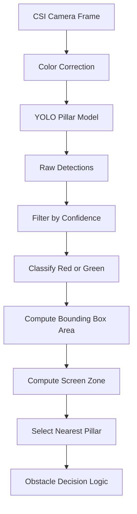
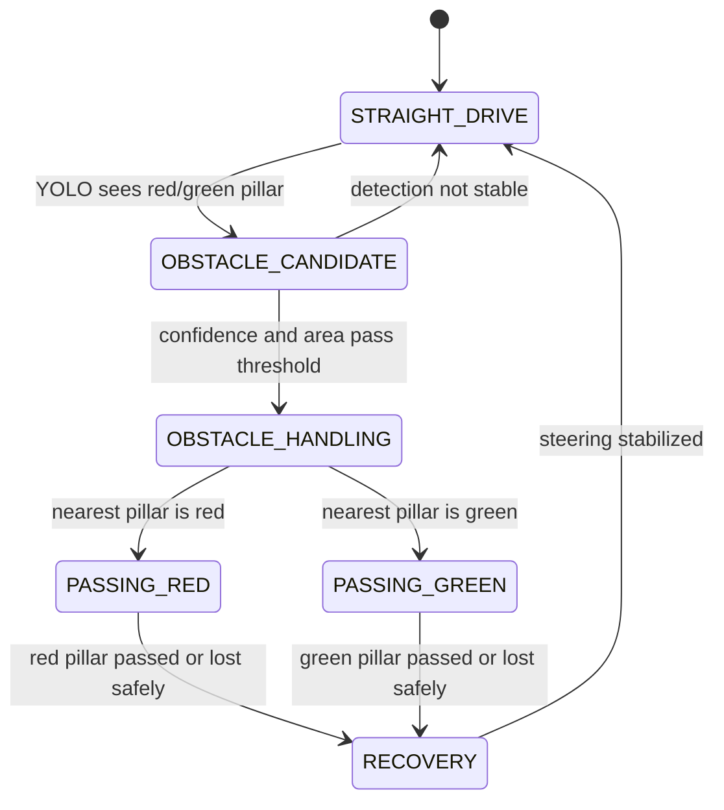

# 04 - Obstacle Strategy

**Project:** MetallicMadness / ARBIBOT  
**Category:** WRO 2026 Future Engineers - Self-Driving Cars  
**Document purpose:** Explain the Obstacle Challenge strategy, including red/green pillar interpretation, YOLO detection, lane behavior, pass-side decision logic, state transitions, controller behavior, and edge-case handling.

> This document focuses on the Obstacle Challenge behavior. It complements `03-software-architecture.md`, which explains the overall Jetson/STM32 software split and DD-UART command flow.

---

## 1. Obstacle Challenge Objective

In the WRO Future Engineers Obstacle Challenge, the robot must drive autonomously around the track while obeying red and green traffic signs. The traffic signs are represented by colored pillars.

The basic rule implemented in ARBIBOT is:

| Traffic sign | Required behavior |
|---|---|
| Red pillar | Pass on the right side |
| Green pillar | Pass on the left side |

The robot must complete the official laps while avoiding moving the traffic signs outside their allowed area. After the laps, the robot must support the route toward the parking lot and parking behavior.

The obstacle strategy therefore has four main goals:

1. Detect the color and position of the nearest pillar.
2. Decide the correct side to pass based on the pillar color.
3. Keep the vehicle stable in the lane while approaching and passing the pillar.
4. Recover safely when detection is uncertain, delayed, or temporarily lost.

---

## 2. System Inputs Used for Obstacle Strategy

ARBIBOT combines camera perception, distance sensors, and internal state tracking.

| Input | Source | Main use |
|---|---|---|
| RGB camera frame | Jetson CSI camera / IMX477 | YOLO pillar detection |
| Pillar class | YOLO model | Determine red or green sign |
| Pillar bounding box | YOLO model | Estimate position and approximate distance |
| Pillar confidence | YOLO model | Filter unreliable detections |
| Right-front distance | VL53L4CD through STM32 | Wall distance and heading correction |
| Right-rear distance | VL53L4CD through STM32 | Heading relative to right wall |
| Left distance | VL53L4CD through STM32 | Side clearance / fallback information |
| Front matrix distance | VL53L8CH through STM32 | Front obstacle / corner awareness |
| Encoder feedback | Motor encoder through STM32 | Speed and movement validation |
| Internal state | Jetson state machine | Prevent conflicting actions |

The camera provides semantic information: **what object is seen and where it is**. The distance sensors provide geometric information: **how the robot is positioned relative to the walls**. The state machine decides which behavior has priority.

---

## 3. Main Software Modules

The Obstacle Challenge behavior is mainly implemented on the Jetson side, while the STM32 provides real-time sensor and motor services.

| File | Role in obstacle strategy |
|---|---|
| `main_challenge_02.py` | Main Obstacle Challenge controller |
| `Pillar_recognition.py` | Converts YOLO detections into structured pillar data |
| `pillar_counter.py` | Debounced enter/exit counting per pillar color |
| `pid_line_follower.py` | Wall/lane-following control |
| `sensor_distance_v3.py` | Reads and parses side/front ToF data from STM32 |
| `motor_driver.py` | Sends speed/forward/stop commands to STM32 |
| `servo_controller.py` | Sends steering commands to Pololu servo controller |
| `color_tuning.py` | Applies per-camera color correction for more stable detection |

The STM32 firmware supports the obstacle strategy through:

| STM32 module | Role |
|---|---|
| `serial_dd_protocol.c/.h` | Receives DD-UART commands and sends responses |
| `sensor_vl53l4cd.c` | Reads side ToF sensors |
| `sensor_vl53l7ch.c` / `sensor_vl53l8ch.c` | Reads front matrix ToF sensor |
| `motor_drv.c/.h` | Controls motor speed, direction, stop, encoder count |
| `main.c` | Command dispatch and main firmware loop |

---

## 4. Pillar Detection Pipeline

The pillar detection pipeline runs on the Jetson.



### 4.1 YOLO Detection Output

For each detected pillar, the software extracts:

| Output | Purpose |
|---|---|
| Class label | Identify `Red_Pillar` or `Green_Pillar` |
| Confidence | Reject weak detections |
| Bounding box center X | Determine whether pillar is left, center, or right in the camera frame |
| Bounding box width/height | Estimate visual size |
| Bounding box area | Estimate approximate closeness |
| Screen zone | Simplify steering logic into left/center/right regions |

The pillar model uses two confirmed classes:

```text
Green_Pillar
Red_Pillar
```

The current pillar confidence threshold is:

```text
0.30
```

This value is intentionally lower than the line/corner threshold because pillars may be partially occluded or visible for only a short time while the vehicle approaches them. A low threshold increases sensitivity, but it also requires filtering and debounce logic to avoid reacting to false positives.

---

## 5. Nearest-Pillar Selection

When more than one pillar is visible, ARBIBOT selects the nearest relevant pillar based mainly on bounding box area.

```text
nearest_pillar = detection with largest_bounding_box_area
```

This works because, under normal camera geometry, closer objects appear larger in the image. The robot therefore prioritizes the pillar most likely to affect the immediate driving path.

### 5.1 Why Area Is Used

| Method | Advantage | Limitation |
|---|---|---|
| Bounding box area | Simple and fast approximation of closeness | Can be affected by partial occlusion |
| Center X only | Useful for steering direction | Does not estimate closeness |
| Confidence only | Helps filter detections | High confidence does not always mean nearest |
| ToF distance to pillar | More direct distance estimate | ToF sensor may not distinguish pillar color |

The selected strategy combines class, position, and area. Color decides the required side. Position gives steering error. Area helps decide whether the pillar is close enough to act.

---

## 6. Screen Zone Model

The camera frame is divided into three horizontal zones:

```text
+----------------+----------------+----------------+
| LEFT THIRD     | CENTER THIRD   | RIGHT THIRD    |
+----------------+----------------+----------------+
```

Each pillar detection is assigned to one of these zones based on its bounding box center.

| Zone | Meaning |
|---|---|
| Left | Pillar appears on the left side of the camera image |
| Center | Pillar is near the robot's forward path |
| Right | Pillar appears on the right side of the camera image |

The zone is not the final decision by itself. It is used to calculate whether the robot is approaching the correct pass side.

---

## 7. Red/Green Pass-Side Strategy

The decision rule is color-based.

| Detected pillar | Required pass side | Strategy |
|---|---|---|
| Red pillar | Right side | Steer so the vehicle path goes to the right of the pillar |
| Green pillar | Left side | Steer so the vehicle path goes to the left of the pillar |

The robot does not simply turn away from a pillar. It tries to place the pillar in the correct part of the camera frame so the vehicle passes on the required side.

### 7.1 Red Pillar Strategy

For a red pillar, the robot must pass on the **right** side of the pillar. This means the robot should guide its path so the red pillar remains to the **left** of the vehicle as it passes.

Simplified behavior:

```text
if pillar == Red_Pillar:
    target_pass_side = RIGHT
    steer to place/keep pillar toward left side of frame
```

### 7.2 Green Pillar Strategy

For a green pillar, the robot must pass on the **left** side of the pillar. This means the robot should guide its path so the green pillar remains to the **right** of the vehicle as it passes.

Simplified behavior:

```text
if pillar == Green_Pillar:
    target_pass_side = LEFT
    steer to place/keep pillar toward right side of frame
```

### 7.3 Why the Pillar Is Driven Into the Opposite Frame Zone

If the robot wants to pass on the right side of a red pillar, the pillar should appear more to the left of the camera frame as the robot approaches. If the robot wants to pass on the left side of a green pillar, the pillar should appear more to the right of the camera frame.

This is a practical camera-frame control strategy. The robot is not building a full 3D map; it is using visual servoing based on where the object appears in the frame.

---

## 8. Obstacle Steering Error

The obstacle steering error is computed from the pillar position relative to a target pass position.

```text
error = target_pass_position - measured_pillar_position
```

Where:

- `measured_pillar_position` is derived from the pillar bounding box center or near edge.
- `target_pass_position` is selected based on the required pass side.
- The target is approximately one screen-third away from the pass-side boundary.

The resulting error is passed to a PDI controller.

---

## 9. PDI Controller for Pillar Passing

During `OBSTACLE_HANDLING`, ARBIBOT uses a PDI-style controller to steer around the pillar.

```text
error = target_position - pillar_position
integral = integral + error
derivative = error - previous_error

control = Kp * error + Ki * integral + Kd * derivative
```

The purpose of the PDI controller is to create a smooth steering correction instead of a harsh fixed turn. Early testing showed that aggressive gains caused the robot to full-lock the steering and lose the target. The current strategy softens the gains and reacts earlier.

### 9.1 Controller Terms

| Term | Purpose |
|---|---|
| Proportional | Steer based on current pillar position error |
| Integral | Correct persistent offset if the robot remains off target |
| Derivative | Reduce overshoot by reacting to fast error changes |

### 9.2 Steering Clamp

The steering output is clamped to avoid extreme steering commands.

```text
steering = clamp(control, min_steering, max_steering)
```

This is important because the MG996R servo and front linkage can mechanically turn the wheels sharply. A full-lock command at the wrong time can cause oscillation, tire scrub, or collision with a wall or pillar.

---

## 10. Lane Behavior During Obstacle Challenge

The robot must follow the lane and pass obstacles correctly. The obstacle behavior does not replace lane behavior; it temporarily overrides or biases it.

### 10.1 Normal Lane-Following Mode

When no active pillar is in the action zone, the robot drives using right-side wall following.

```text
distance_error = target_right_distance - average(right_front, right_rear)
heading_error = right_front - right_rear
lane_steering = Kd * distance_error + Kh * heading_error
```

| Sensor | Role |
|---|---|
| Right-front VL53L4CD | Measures front-side distance to right wall |
| Right-rear VL53L4CD | Measures rear-side distance to right wall |
| Difference RF - RR | Estimates heading relative to wall |
| Average RF/RR | Estimates lateral distance from wall |

Using two right-side sensors is better than using one side sensor because it allows the robot to detect whether it is angled toward or away from the wall.

### 10.2 Obstacle Override Mode

When a valid pillar enters the action zone, obstacle steering takes priority.

```text
if pillar_in_action_zone:
    steering = obstacle_pdi_output
else:
    steering = lane_following_output
```

A more advanced version can blend both:

```text
steering = obstacle_weight * obstacle_steering + lane_weight * lane_steering
```

Current strategy favors obstacle priority because passing on the correct side is more important than maintaining the ideal wall distance for a few moments.

### 10.3 Return to Lane Following

After the pillar is passed or lost safely:

1. The robot exits `OBSTACLE_HANDLING`.
2. The PDI integral term is reset.
3. Steering is returned gradually toward lane-following behavior.
4. The robot resumes right-wall heading correction.

This prevents the robot from continuing to steer around a pillar that is no longer relevant.

---

## 11. Obstacle State Machine



### 11.1 State Descriptions

| State | Purpose |
|---|---|
| `STRAIGHT_DRIVE` | Follow wall and scan for pillars |
| `OBSTACLE_CANDIDATE` | A pillar is detected, but detection is not yet trusted |
| `OBSTACLE_HANDLING` | Pillar is active and steering is controlled by pass-side logic |
| `PASSING_RED` | Red-specific right-pass behavior |
| `PASSING_GREEN` | Green-specific left-pass behavior |
| `RECOVERY` | Return from obstacle steering to normal lane behavior |

The implementation may combine some of these logical states inside `OBSTACLE_HANDLING`, but documenting them separately makes the strategy easier to understand and test.

---

## 12. Pillar Debounce and Counting

The robot uses `pillar_counter.py` to reduce false counting and repeated reactions.

### 12.1 Why Debounce Is Needed

YOLO detections can flicker:

- a pillar may disappear for one frame,
- confidence may drop due to blur,
- lighting can change,
- the pillar can be partially hidden by the robot's own movement,
- or multiple detections can briefly appear.

Without debounce, the robot might count the same pillar multiple times or switch rapidly between obstacle and lane behavior.

### 12.2 Debounce Logic

The debounce logic should confirm:

1. The pillar appears for enough frames.
2. The class remains stable.
3. The object is large enough to be relevant.
4. The object exits before it can be counted again.

Suggested logic:

```text
if same_color_detected_for_N_frames:
    confirm pillar entry

if confirmed_pillar disappears_for_M_frames or area drops below threshold:
    confirm pillar exit
```

---

## 13. Action Zone

The robot should not react to every small detection. It should react when the pillar is relevant to the near driving path.

A pillar becomes active when:

| Condition | Purpose |
|---|---|
| Confidence is above threshold | Avoid weak detections |
| Bounding box area is above minimum | Avoid far-away pillars |
| Pillar is in a relevant screen zone | Avoid reacting to irrelevant side objects |
| Detection is stable for several frames | Avoid flicker |
| Robot is not currently cornering | Avoid conflict with turn behavior |

### 13.1 Early Reaction vs Late Reaction

Early tests showed that reacting too late caused aggressive steering. The robot had to turn sharply and could lose the target. The improved strategy reacts earlier with softer steering.

| Reaction timing | Result |
|---|---|
| Too early | Robot may overcorrect for a far object |
| Too late | Robot may full-lock steering and hit/loss target |
| Controlled early action | More stable pass-side path |

The selected approach is to detect early, confirm stability, and then apply a limited steering correction.

---

## 14. Red Pillar Detailed Behavior

### 14.1 Expected Sequence

```text
1. YOLO detects Red_Pillar.
2. Detection confidence and area are checked.
3. Robot enters OBSTACLE_HANDLING.
4. Target pass side is set to RIGHT.
5. Controller steers so the red pillar moves/holds toward the left region of the camera frame.
6. Robot passes to the right of the red pillar.
7. Pillar exits the active area.
8. Controller returns to wall-following.
```

### 14.2 Red Pillar Risks

| Risk | Description | Mitigation |
|---|---|---|
| Red detected too late | Robot cannot move right enough | Lower area trigger / react earlier |
| Red misclassified as green | Wrong pass side | Improve dataset and confidence filtering |
| Red near wall | Limited passing space | Use lane distance sensors to avoid wall collision |
| Lost detection while passing | Controller may return too early | Hold last valid command briefly |
| Steering saturates | Robot full-locks and oscillates | Clamp steering output |

---

## 15. Green Pillar Detailed Behavior

### 15.1 Expected Sequence

```text
1. YOLO detects Green_Pillar.
2. Detection confidence and area are checked.
3. Robot enters OBSTACLE_HANDLING.
4. Target pass side is set to LEFT.
5. Controller steers so the green pillar moves/holds toward the right region of the camera frame.
6. Robot passes to the left of the green pillar.
7. Pillar exits the active area.
8. Controller returns to wall-following.
```

### 15.2 Green Pillar Risks

| Risk | Description | Mitigation |
|---|---|---|
| Green is missed | Robot may continue lane-following and pass wrong side | Lower threshold, improve training data |
| Green detected as red | Wrong pass side | Add more labeled examples under WRO lighting |
| Green appears at frame edge | Position error may be unreliable | Use near-edge logic and area threshold |
| Robot reacts too sharply | Steering full-lock / wall hit | Softer PDI gains and steering clamp |
| Pillar temporarily disappears | Frame blur or partial occlusion | Use short memory of last valid detection |

The green pillar case is especially important because earlier tests showed recognition issues when motor commands blocked the vision loop. The solution was to avoid blocking waits during motor commands and keep detection responsive.

---

## 16. Integration with Cornering

The obstacle strategy must not conflict with cornering behavior. A pillar near a corner can create ambiguous commands if the robot tries to turn the corner and pass a pillar at the same time.

### 16.1 Priority Order

Recommended behavior priority:

```text
1. Emergency stop / safety condition
2. Active cornering if turn has already started
3. Obstacle handling if pillar is in action zone
4. Lane following
5. Search / fallback behavior
```

### 16.2 Corner Lockout

During `CORNERING`, the robot can temporarily ignore pillar detections until the turn cooldown ends.

```text
if state == CORNERING:
    ignore new pillar candidate unless emergency condition exists
```

This prevents a pillar detection from interrupting the timed turn. After the blind/cooldown period, obstacle detection becomes active again.

### 16.3 Pre-Corner Pillar

If a pillar is seen before the corner trigger, the robot handles the pillar first, then returns to lane behavior and later handles the corner.

```text
if pillar_active and not cornering:
    handle pillar
elif corner_trigger:
    handle corner
```

---

## 17. Wrong-Side Prevention

The robot should recognize when it is likely approaching the wrong side of a traffic sign and correct before fully passing it.

### 17.1 Warning Conditions

| Condition | Meaning |
|---|---|
| Red pillar remains on wrong side of frame while area grows | Robot may pass red on the wrong side |
| Green pillar remains on wrong side of frame while area grows | Robot may pass green on the wrong side |
| PDI output saturates for too long | Robot cannot correct enough |
| Side distance too close to wall | Not enough space for required pass |
| Detection disappears while area was large | Robot may be beside the pillar |

### 17.2 Recovery Actions

Possible recovery behavior:

```text
if wrong_side_risk_detected:
    reduce_speed()
    hold_last_valid_pillar_class()
    apply_stronger_but_clamped_steering()
    use side sensors to avoid wall collision
```

If the robot has not fully crossed the pillar line, a correction may still avoid a rule error. This is why the strategy favors early detection and active correction instead of waiting until the pillar is already beside the robot.

---

## 18. Lost Target Handling

Target loss is common in real vision systems. The robot may temporarily lose a pillar due to blur, lighting, occlusion, or camera angle.

### 18.1 Lost Target States

| Situation | Behavior |
|---|---|
| Small/far pillar lost | Return to lane following |
| Active close pillar lost briefly | Hold last steering command for short timeout |
| Active close pillar lost for too long | Gradually return to lane following |
| Multiple pillars visible after loss | Select largest valid detection |

### 18.2 Last Valid Detection Memory

The robot can remember the last valid pillar class and position for a short time.

```text
if current_detection is None and time_since_last_detection < LOST_TARGET_TIMEOUT:
    use last_valid_detection
else:
    return to lane_following
```

This prevents instant behavior changes due to one missed frame.

---

## 19. Multiple Pillar Handling

In the Obstacle Challenge, more than one pillar may be visible in the camera frame. The strategy is to handle only the most immediate relevant one.

### 19.1 Selection Rules

Priority order:

```text
1. Valid class: red or green
2. Confidence above threshold
3. Bounding box area above minimum
4. Largest area / nearest pillar
5. Located in relevant action zone
```

### 19.2 Why Not Handle All Pillars at Once

Trying to optimize around multiple signs at once would require mapping and prediction. ARBIBOT uses a reactive approach: detect the next relevant obstacle, pass it correctly, then return to lane-following. This is simpler, easier to debug, and more reliable for the current robot.

---

## 20. Lane Recovery After Passing

After the robot passes a pillar, it must avoid overcorrecting back into the wall or across the lane.

### 20.1 Recovery Sequence

```text
1. Pillar area decreases or exits frame.
2. Mark pillar as passed.
3. Reset PDI integral term.
4. Reduce obstacle steering weight.
5. Gradually restore wall-following steering.
6. Resume STRAIGHT_DRIVE.
```

### 20.2 Why Gradual Recovery Matters

If the robot instantly switches from obstacle steering to lane-following, it may jerk back toward the target wall distance. A smoother transition reduces oscillation and keeps the robot stable.

---

## 21. Speed Strategy During Obstacle Handling

Speed must be balanced with detection and steering response.

| Situation | Suggested speed behavior |
|---|---|
| No pillar visible | Normal challenge speed |
| Pillar candidate visible | Maintain or slightly reduce speed |
| Active close pillar | Reduce speed if steering error is high |
| Steering saturated | Reduce speed |
| Lost target while close | Reduce speed and hold last correction |
| After passing | Return gradually to normal speed |

The robot should not drive as fast near a pillar as it does on an empty straight section. More speed leaves less time for YOLO detection, PDI correction, and mechanical steering response.

---

## 22. Edge Cases

### 22.1 False Positive Detection

**Problem:** YOLO detects a pillar where there is none.

**Risk:** Robot steers unnecessarily and may leave the lane.

**Mitigation:**

- require minimum confidence,
- require minimum bounding box area,
- require stable detection for multiple frames,
- ignore detections during cornering cooldown,
- and return to wall-following if detection disappears quickly.

### 22.2 False Negative Detection

**Problem:** A real pillar is not detected.

**Risk:** Robot follows the lane and may pass on the wrong side or hit the pillar.

**Mitigation:**

- use lower threshold for pillar model,
- improve dataset with more lighting conditions,
- apply color correction,
- avoid blocking the camera loop with serial waits,
- and react earlier when a detection becomes valid.

### 22.3 Color Misclassification

**Problem:** Red is detected as green or green as red.

**Risk:** Robot selects the wrong pass side.

**Mitigation:**

- improve labeled dataset,
- include track lighting variations,
- include partially occluded pillars,
- use confidence gap between classes if available,
- optionally cross-check with color sampling inside the bounding box.

### 22.4 Pillar Near Frame Edge

**Problem:** A pillar is visible only at the edge of the camera frame.

**Risk:** Center X may be unreliable; steering error may overreact.

**Mitigation:**

- use near edge of bounding box instead of center when appropriate,
- require area threshold,
- limit steering clamp,
- and rely on lane-following until the pillar becomes more central/relevant.

### 22.5 Pillar Too Close

**Problem:** The robot detects the pillar late.

**Risk:** Not enough distance remains to pass correctly.

**Mitigation:**

- reduce speed near active pillar,
- react earlier using a lower area trigger,
- hold last valid detection,
- and avoid blocking camera inference.

### 22.6 Multiple Pillars in Frame

**Problem:** Robot sees more than one pillar.

**Risk:** It may steer for the wrong pillar.

**Mitigation:**

- choose the largest valid bounding box,
- ignore very small/far detections,
- prioritize objects inside the action zone,
- and use debounce to avoid target switching.

### 22.7 Pillar During Corner

**Problem:** A pillar is detected while the robot is entering or executing a corner.

**Risk:** Steering commands conflict.

**Mitigation:**

- cornering has a temporary lockout,
- obstacle handling is allowed before or after cornering,
- and the robot ignores new pillar candidates during the timed turn cooldown.

### 22.8 Wall Too Close During Pass

**Problem:** To pass the pillar correctly, the robot moves too close to a wall.

**Risk:** Wall hit or loss of track position.

**Mitigation:**

- use side ToF as a safety boundary,
- clamp steering,
- reduce speed,
- and blend obstacle correction with wall-distance correction when needed.

### 22.9 Detection Blocked by Serial Wait

**Problem:** Motor command waits block the vision loop.

**Risk:** YOLO update becomes late; pillar is missed.

**Mitigation:**

- sensor thread owns serial reads,
- motor commands are sent fire-and-forget when safe,
- critical commands are pulsed,
- and matrix polling is controlled instead of continuous maximum polling.

### 22.10 Dropped Stop or Start Command

**Problem:** A critical DD-UART command is dropped on the shared serial link.

**Risk:** Robot may not start, may continue moving, or may fail to stop.

**Mitigation:**

- pulse start/stop commands several times,
- keep command frames short,
- avoid heavy matrix reads during critical actions,
- and verify response when safe to do so.

---

## 23. Test Cases for Obstacle Strategy

The following tests should be used to validate the obstacle strategy.

| Test ID | Scenario | Expected behavior | Result |
|---|---|---|---|
| OBS-01 | Single red pillar in center of lane | Robot passes on right | [TODO] |
| OBS-02 | Single green pillar in center of lane | Robot passes on left | [TODO] |
| OBS-03 | Red pillar near left side | Robot still passes on right without wall hit | [TODO] |
| OBS-04 | Green pillar near right side | Robot still passes on left without wall hit | [TODO] |
| OBS-05 | Two pillars visible | Robot chooses nearest/largest valid one | [TODO] |
| OBS-06 | Pillar appears during corner cooldown | Robot prioritizes corner, then resumes detection | [TODO] |
| OBS-07 | YOLO detection flickers | Debounce prevents unstable steering | [TODO] |
| OBS-08 | Pillar temporarily lost while close | Last-valid memory keeps correction briefly | [TODO] |
| OBS-09 | High steering error | Robot clamps steering and reduces speed | [TODO] |
| OBS-10 | Full obstacle lap | Robot completes lap while obeying signs | [TODO] |

---

## 24. Tuning Parameters

The following parameters should be listed and updated as the software is tuned.

| Parameter | Current / planned value | Purpose |
|---|---:|---|
| Pillar confidence threshold | 0.30 | Minimum YOLO confidence for pillar detection |
| Minimum active area | [TODO] | Avoid reacting to far/small detections |
| Lost target timeout | [TODO] | Time to hold last valid detection |
| Debounce entry frames | [TODO] | Frames required to confirm pillar |
| Debounce exit frames | [TODO] | Frames required to confirm pillar exit |
| PDI Kp | [TODO] | Proportional steering response |
| PDI Ki | [TODO] | Integral correction |
| PDI Kd | [TODO] | Derivative damping |
| Max steering clamp | [TODO] | Prevent full-lock steering |
| Obstacle speed | [TODO] | Speed while passing pillar |
| Normal straight speed | [TODO] | Speed while no obstacle is active |
| Target right wall distance | [TODO] | Lane-following distance |
| RF-RR heading gain | [TODO] | Parallel-wall correction |

Documenting these values is important because it makes the obstacle strategy reproducible and shows the tuning process.

---

## 25. Known Issues and Improvements

| Issue | Current status | Planned improvement |
|---|---|---|
| Green pillar recognition affected by blocking motor commands | Improved by non-blocking motor command strategy | Measure inference timing and serial latency |
| PDI steering can become aggressive if gains are high | Gains softened | Record final tuned gains |
| Late obstacle reaction can cause sharp steering | Reaction starts earlier | Add active-area plots from test video |
| Multiple detections can create target switching | Largest-area selection and debounce | Add target persistence score |
| Front matrix polling can slow serial bus | Poll on demand | Add timed polling schedule |
| Parking phase not fully documented here | Pending separate parking strategy | Add `docs/parking-strategy.md` or section later |

---

## 26. Evidence to Add

To make this document stronger for WRO evaluation, add:

1. Screenshots of YOLO detecting red and green pillars.
2. A short image sequence showing approach, pass, and recovery.
3. A plot of pillar X-position versus steering command.
4. A table of successful red/green pass tests.
5. Final PDI gains.
6. Final speed values used during obstacle handling.
7. Video links for Obstacle Challenge test runs.
8. Failure examples and what changed after each failure.

Recommended repository locations:

```text
docs/04-obstacle-strategy.md
schemes/obstacle-state-machine.png
schemes/pillar-screen-zones.png
other/testing/obstacle-test-results.csv
video/obstacle-challenge.md
```

---

## 27. Conclusion

ARBIBOT's obstacle strategy uses the Jetson camera and YOLO model to detect red and green pillars, while the STM32 provides real-time distance sensor and motor support. The robot determines the required pass side from the pillar color: red is passed on the right, and green is passed on the left. The camera frame is divided into zones, and a PDI controller steers the robot so the detected pillar moves into the correct relative position for passing.

Normal lane behavior is based on right-wall following using the right-front and right-rear VL53L4CD sensors. When a pillar enters the action zone, obstacle steering temporarily takes priority. After the pillar is passed, the robot gradually returns to wall-following.

The main engineering improvements in this strategy are:

- YOLO-based red/green classification instead of color thresholding only,
- nearest-pillar selection using bounding box area,
- screen-zone-based pass-side steering,
- PDI control with steering clamp,
- right-wall heading correction using two side sensors,
- debounce and last-valid detection handling,
- critical command pulsing to survive serial drops,
- and edge-case logic for lost targets, false detections, and corner conflicts.

The remaining work is to record final tuning values, add measured success rates, and include annotated test images/videos. Once these are added, this document will provide a strong explanation of ARBIBOT's Obstacle Challenge strategy.
