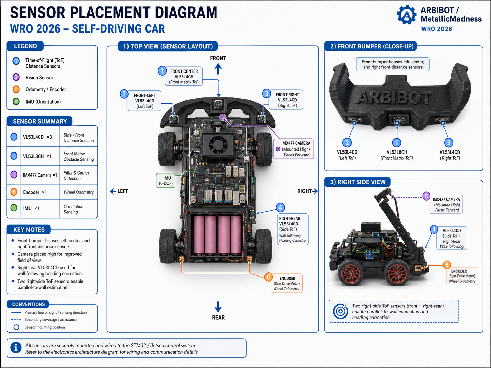
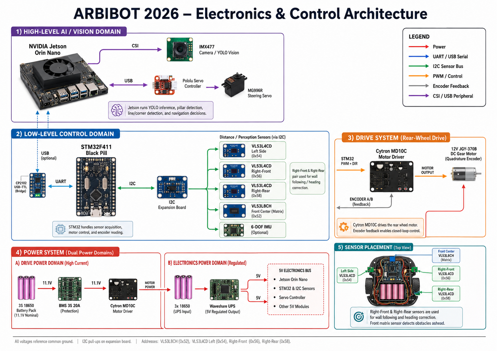

# Docs

This folder contains the main engineering documentation for the **MetallicMadness / ARBIBOT** WRO Future Engineers self-driving car project.

The purpose of this folder is to explain the robot design in a structured way: mechanical design, power architecture, sensors, software, obstacle strategy, engineering decisions, testing, calibration, bill of materials, and risk management.

These documents complement the root `README.md`, the Engineering Journal, the diagrams in `schemes/`, the robot photos in `v-photos/`, and the challenge videos in `video/`.

## Folder contents

| File | Description |
|---|---|
| `01-mechanical-design.md` | Mechanical design documentation, including chassis, dimensions, drivetrain, steering system, motor selection, wheels, bumper design, mechanical iterations, and known mechanical failure modes. |
| `02-power-and-sensor-architecture.md` | Power and sensor architecture, including motor power, Jetson/electronics power, BMS, UPS, current estimates, grounding, VL53 sensor placement, I2C wiring, XSHUT control, and sensor calibration notes. |
| `03-software-architecture.md` | Software architecture for Jetson and STM32, including Python modules, STM32 firmware responsibilities, DD-UART command protocol, state machine, sensor processing, motor control, and challenge control flow. |
| `04-obstacle-strategy.md` | Obstacle Challenge strategy, including red/green pillar behavior, YOLO detection pipeline, nearest-pillar selection, PDI steering control, lane recovery, edge cases, and tuning notes. |
| `05-systems-thinking-decisions.md` | Engineering decision record and systems-thinking document explaining why major design choices were made, what alternatives were rejected, and how failures changed the robot design. |
| `06-testing-and-tuning.md` | Testing and tuning documentation, including test-run logs, lap-time templates, success-rate calculation, failure analysis, motor tests, sensor tests, vision tests, obstacle tests, and tuning parameters. |
| `07-calibration-procedures.md` | Calibration procedures for camera alignment, YOLO confidence, screen zones, ToF thresholds, front matrix trigger, servo center, steering limits, motor speed, encoder validation, and battery logging. |
| `09-bill-of-materials.md` | Bill of Materials documenting the main mechanical, electrical, power, compute, sensor, motor, and communication components, including function, voltage, estimated current, and interface. |
| `10-risk-register.md` | Risk register and failure-mode documentation, including glare, bad pillar detection, sensor noise, UART timeout, motor blocking, weak battery, stop-command failure, wheel slip, steering misalignment, and parking risks. |

## Recommended reading order

For judges, mentors, and new developers, the recommended order is:

```text
01-mechanical-design.md
02-power-and-sensor-architecture.md
03-software-architecture.md
04-obstacle-strategy.md
05-systems-thinking-decisions.md
06-testing-and-tuning.md
07-calibration-procedures.md
09-bill-of-materials.md
10-risk-register.md
```

This order starts with the physical robot, then explains power and sensors, then software and strategy, then testing, calibration, hardware inventory, and risk management.

## Document map by topic

### Mechanical system

Read:

```text
01-mechanical-design.md
05-systems-thinking-decisions.md
09-bill-of-materials.md
```

Main topics:

- 3D-printed chassis,
- vehicle dimensions,
- rear-wheel drive,
- steering linkage,
- wheel selection,
- front bumper design,
- mechanical iterations,
- traction and alignment.

### Power and electronics

Read:

```text
02-power-and-sensor-architecture.md
09-bill-of-materials.md
10-risk-register.md
```

Main topics:

- motor battery path,
- 3S BMS,
- Cytron MD10C motor driver,
- Jetson UPS/electronics power,
- 5V and 3.3V rails,
- current estimates,
- common ground,
- power-related risks.

### Sensors

Read:

```text
02-power-and-sensor-architecture.md
06-testing-and-tuning.md
07-calibration-procedures.md
10-risk-register.md
```

Main topics:

- VL53L4CD side sensors,
- VL53L8CH front matrix sensor,
- right-front/right-rear heading correction,
- I2C bus,
- XSHUT control,
- invalid reading handling,
- sensor calibration,
- front matrix trigger tuning.

### Software

Read:

```text
03-software-architecture.md
04-obstacle-strategy.md
06-testing-and-tuning.md
07-calibration-procedures.md
```

Main topics:

- Jetson Python code,
- STM32 firmware responsibilities,
- YOLO inference,
- Open Challenge state machine,
- Obstacle Challenge logic,
- DD-UART serial protocol,
- motor command strategy,
- sensor caching,
- lane-following control.

### Obstacle Challenge

Read:

```text
04-obstacle-strategy.md
06-testing-and-tuning.md
07-calibration-procedures.md
10-risk-register.md
```

Main topics:

- red pillar pass-side behavior,
- green pillar pass-side behavior,
- YOLO object detection,
- bounding-box area as closeness estimate,
- screen zones,
- PDI steering,
- target loss,
- false detection,
- obstacle test matrix.

### Testing, calibration, and risk

Read:

```text
06-testing-and-tuning.md
07-calibration-procedures.md
10-risk-register.md
```

Main topics:

- test-run logs,
- lap-time tables,
- success-rate calculation,
- failure analysis,
- servo center calibration,
- motor speed calibration,
- ToF calibration,
- YOLO confidence calibration,
- risk mitigation.

## Related folders

| Folder | Purpose |
|---|---|
| `../schemes/` | Architecture, full wiring, power distribution, and sensor placement diagrams. |
| `../v-photos/` | Real robot photos: back, left, right, top, and front bumper views. |
| `../t-photos/` | Team photos. |
| `../video/` | Challenge videos and test-run evidence. |
| `../Models/` | YOLO model checkpoints and model documentation. |
| `../other/protocol/` | DD-UART protocol documentation and protocol reference files. |
| `../src/` | Jetson Python code and STM32-related source files. |
| `../engineering-journal/` | Main engineering journal in Markdown/PDF form. |

## Important related files

| File | Relationship |
|---|---|
| `../README.md` | Main project overview. |
| `../schemes/arbibot_2026_electronics_and_control_architecture.png` | High-level electronics and control architecture diagram. |
| `../schemes/full-wiring-diagram.png` | Complete wiring reference. |
| `../schemes/power-distribution-diagram.png` | Power-domain reference. |
| `../schemes/sensor-placement-diagram.png` | Physical sensor layout reference. |
| `../other/protocol/dd-uart-protocol.md` | Detailed serial protocol used between Jetson and STM32. |
| `../video/challenge01.mp4` | Open Challenge video evidence. |

## Documentation status

| Document | Status | Notes |
|---|---|---|
| `01-mechanical-design.md` | Draft complete | Needs final track width and final measured values. |
| `02-power-and-sensor-architecture.md` | Draft complete | Needs measured current values and final verified voltage rails. |
| `03-software-architecture.md` | Draft complete | Needs final code-path verification after last software changes. |
| `04-obstacle-strategy.md` | Draft complete | Needs final Obstacle Challenge test results. |
| `05-systems-thinking-decisions.md` | Draft complete | Needs final measured values where marked `[TODO]`. |
| `06-testing-and-tuning.md` | Draft complete | Needs final lap times, success rates, and test-run data. |
| `07-calibration-procedures.md` | Draft complete | Needs final calibration values. |
| `08-build-flash-run-guide.md` | Not created yet | Recommended next document: build, flash, setup, and run instructions. |
| `09-bill-of-materials.md` | Draft complete | Needs measured current values and final part metadata. |
| `10-risk-register.md` | Draft complete | Needs final evidence to close highest risks. |

## Pending recommended document

The missing document in the current sequence is:

```text
08-build-flash-run-guide.md
```

Recommended content:

- Jetson setup,
- Python environment,
- dependencies,
- camera test,
- YOLO model path setup,
- STM32 firmware build/flash,
- serial port selection,
- motor/sensor test commands,
- how to run Open Challenge,
- how to run Obstacle Challenge,
- common troubleshooting.

## Naming convention

All documentation files in this folder should use:

```text
NN-topic-name.md
```

Where:

- `NN` is a two-digit order number,
- words are lowercase,
- words are separated with hyphens,
- file extension is `.md`.

Examples:

```text
01-mechanical-design.md
02-power-and-sensor-architecture.md
03-software-architecture.md
```

## How to reference diagrams

From a document inside this folder, reference diagrams using `../schemes/`.

Example:

```markdown

```

Example references:

```markdown



```

## How to reference photos

From a document inside this folder, reference vehicle photos using `../v-photos/`.

Example:

```markdown


```

## How to reference videos

From a document inside this folder, reference videos using `../video/`.

Example:

```markdown
[Open Challenge test video](../video/challenge01.mp4)
```

## Update policy

When the robot changes, update the documentation that is affected.

Examples:

| Change | Documents to update |
|---|---|
| Steering linkage changed | `01-mechanical-design.md`, `07-calibration-procedures.md`, `10-risk-register.md` |
| Battery or power wiring changed | `02-power-and-sensor-architecture.md`, `09-bill-of-materials.md`, `10-risk-register.md` |
| Sensor position changed | `02-power-and-sensor-architecture.md`, `07-calibration-procedures.md`, `schemes/sensor-placement-diagram.png` |
| YOLO model changed | `03-software-architecture.md`, `04-obstacle-strategy.md`, `07-calibration-procedures.md`, `../Models/README.md` |
| Motor command protocol changed | `03-software-architecture.md`, `../other/protocol/dd-uart-protocol.md`, `10-risk-register.md` |
| New test result recorded | `06-testing-and-tuning.md` |
| New failure discovered | `10-risk-register.md`, `06-testing-and-tuning.md` |

## Commit recommendation

When editing documentation, commit related changes together.

Example:

```bash
git add docs/06-testing-and-tuning.md docs/10-risk-register.md
git commit -m "docs: update testing results and risk register"
git push
```

## Current status

This folder currently contains the main documentation set for ARBIBOT. Most documents are complete as engineering drafts and should now be updated with final measured values, final test results, and final calibration data as the robot continues testing.
