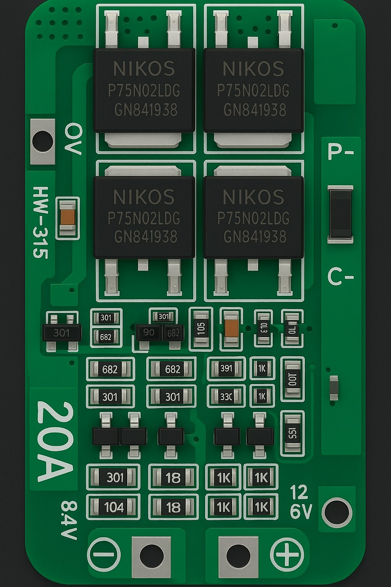
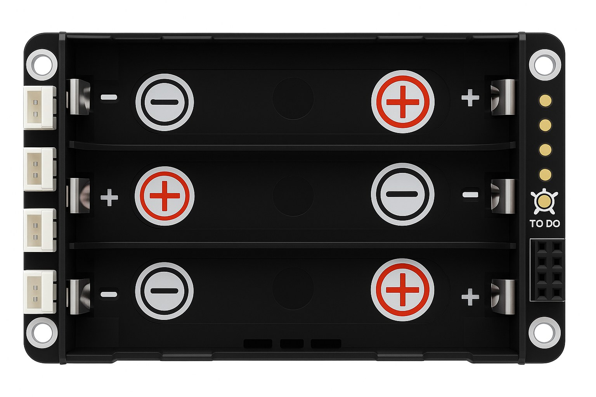
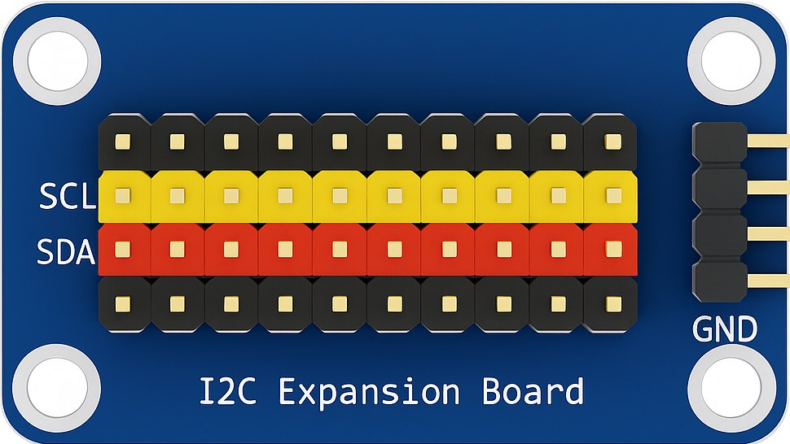
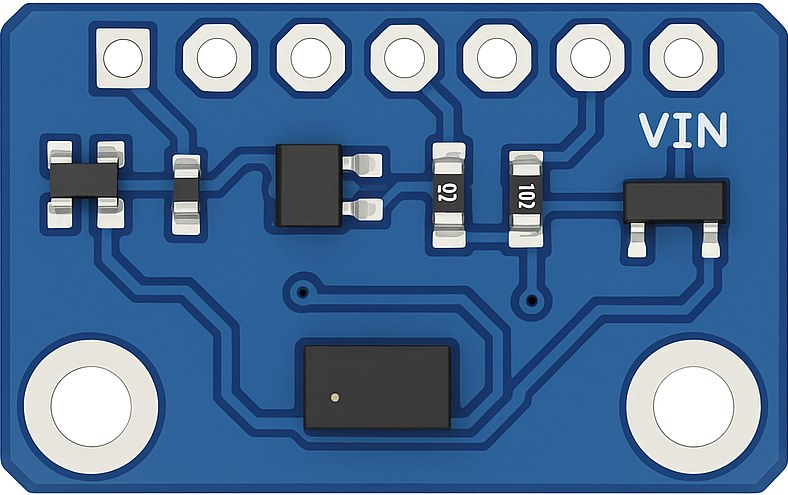
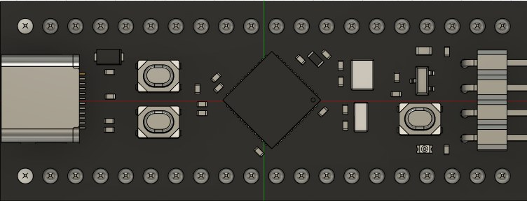
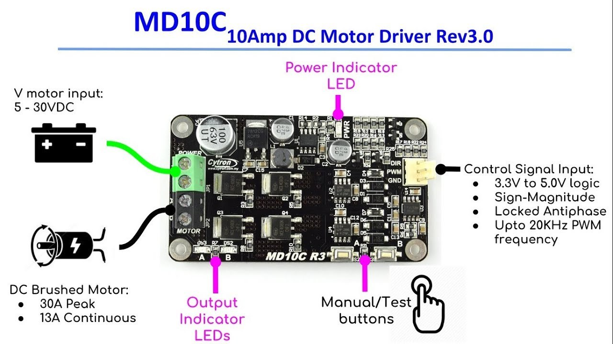
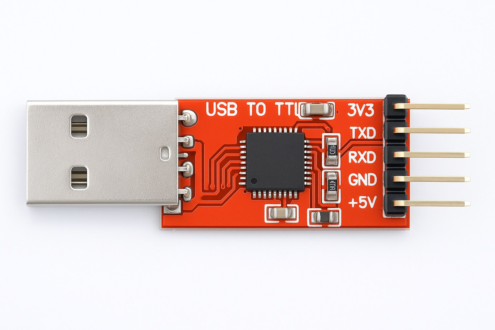
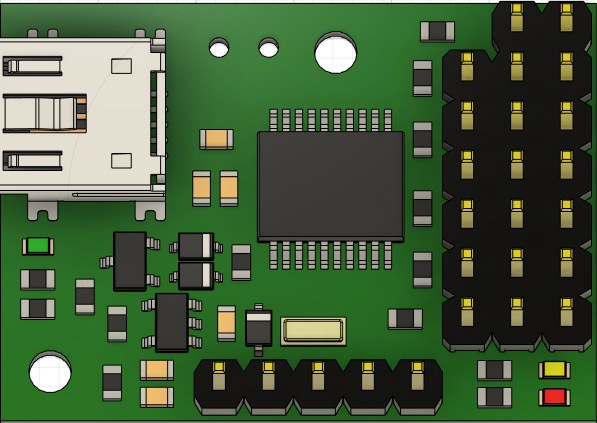
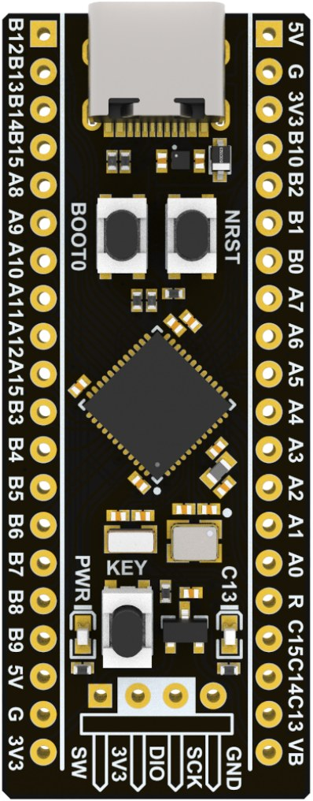

# Engineering Journal - MetallicMadness / ARBIBOT


**Figure 0. ARBIBOT on the WRO Future Engineers field mat.**

**Competition:** WRO 2026 Future Engineers - Self-Driving Cars  
**Team:** MetallicMadness  
**Robot:** ARBIBOT  
**Organization:** Universidad Metropolitana, Caracas  
**Document status:** Draft 1 - prepared from current team information. Replace `[TODO]` fields before final submission.

---

## 1. Introduction

ARBIBOT is a four-wheel autonomous vehicle designed for the WRO Future Engineers Self-Driving Cars challenge. The robot is built around a split-control architecture: an NVIDIA Jetson Orin Nano performs high-level perception and navigation decisions, while an STM32F411 microcontroller handles low-level peripheral control, distance sensors, motor control, encoder feedback, and serial command execution.

The design objective is to build a stable self-driving robot able to complete the Open Challenge and the Obstacle Challenge using sensor fusion between computer vision, ToF distance sensors, motor feedback, and deterministic control logic. The engineering work focuses on reliability under competition constraints: limited vehicle size, autonomous operation, random field configuration, lighting variation, sensor noise, power stability, and fast recovery from edge cases.

This journal is organized to match the WRO engineering documentation rubric: mobility and mechanical design, power and sensor architecture, software and obstacle strategy, systems thinking, reproducibility, and testing.

---

## 2. Team Overview

| Role | Name | Summary |
|---|---|---|
| Student | Daniel Jose Denis Castillo | Electrical Engineering student at Universidad Metropolitana in Caracas. Strong interest in electronics, robotics, Python, AI models, and technical problem solving. |
| Student | Douglas Gabriel Ordaz Yanez | Electrical Engineering and Computer Engineering student at Universidad Metropolitana in Caracas. Strong interest in software development, coding logic, and game programming. |
| Tutor / Coach | Daniel Jose Denis Rodriguez | Electrical Engineer from Universidad Metropolitana with more than 25 years of experience in software engineering, telecommunications, AI, cybersecurity, embedded systems, and technology leadership. |

---

## 3. Design Goals and WRO Constraints

The robot was designed around the following WRO-related engineering constraints:

| Constraint / Requirement | ARBIBOT design response |
|---|---|
| Four-wheel vehicle, not differential drive | Rear-wheel drive with a front steering actuator. The two rear wheels are mechanically linked through the drive system. |
| One steering actuator | MG996R servo drives a pushrod/tie-rod steering linkage. |
| Autonomous operation | Jetson and STM32 run onboard; no wireless control is used during a round. |
| Maximum dimensions | Current dimensions: 25 cm length x 15.6 cm width x 18 cm height. |
| Maximum weight | Current measured weight: 1.35 kg. |
| Challenge time | Estimated runtime is 20-30 minutes, comfortably above the 3-minute round requirement. |
| Randomized field | Software uses sensor fusion and state logic instead of hard-coded field layouts. |

---

## 4. Overall System Architecture

ARBIBOT uses a two-controller architecture:

1. **NVIDIA Jetson Orin Nano:** high-level perception, AI inference, camera processing, navigation decisions, YOLO-based pillar and line/corner detection, and command generation.
2. **STM32F411 Black Pill:** low-level real-time controller for ToF sensors, IMU, motor driver, encoder feedback, and DD-UART command handling.

The Jetson sends compact commands to the STM32 through a custom binary USART protocol. The STM32 executes deterministic peripheral operations and returns sensor values or command acknowledgements. This separation keeps the Jetson focused on perception and planning while the microcontroller handles real-time I/O.

### System block overview

```text
Camera + YOLO + navigation logic
        |
        v
NVIDIA Jetson Orin Nano
        |
        | USB serial / DD-UART protocol
        v
STM32F411 Black Pill
        |------------------- ToF sensors / IMU
        |------------------- Cytron MD10C motor driver
        |------------------- Encoder feedback
        |------------------- Sensor address/reset control

Separate power domains:
- Motor power: 3S Li-ion pack + BMS 3S 20A -> Cytron MD10C -> DC motor
- Jetson/logic power: Waveshare UPS -> Jetson + camera + Pololu servo controller
```


**Figure 1. STM32F411 wiring and peripheral integration diagram.**

---

## 5. Mobility and Mechanical Design

### 5.1 Mechanical summary

| Item | Current design |
|---|---|
| Chassis | 3D printed chassis |
| Vehicle length | 25 cm |
| Vehicle width | 15.6 cm |
| Vehicle height | 18 cm |
| Weight | 1.35 kg |
| Wheelbase | 13.9 cm |
| Track width | [TODO: measure distance between left and right wheels] |
| Drive configuration | Rear-wheel drive |
| Steering | Servo-actuated pushrod steering with tie-rod linkage |
| Steering servo | MG996R, 5 V, approx. 9.4 kg-cm at 4.8 V |
| Drive motor | JGY-370B 12 V DC worm gear motor with encoder, 150 RPM |

### 5.2 Steering mechanism

The vehicle uses a **servo-actuated front steering mechanism**. The steering servo moves a control arm connected to a pushrod. The pushrod actuates one front steering knuckle, and both front wheels are mechanically connected by a tie rod. Therefore, the motion of one wheel is transferred to the other front wheel, producing synchronized front steering using a single steering actuator.

The mechanism is best described as a **custom servo-driven pushrod and tie-rod steering linkage**. It is Ackermann-inspired, but it should not be claimed as a validated Ackermann geometry until the inner and outer wheel angles are measured during steering.


**Figure 2. Steering linkage close-up showing pushrod and tie-rod connection.**

### 5.3 Drive motor and encoder

ARBIBOT uses a JGY-370B 12 V mini worm gear DC motor with encoder feedback. The motor is a double-shaft DC gear motor with hall-coded tachymetry feedback and 150 RPM nominal no-load speed. The selected motor includes metal gears and self-locking behavior, which improves vehicle holding behavior when power is removed.

Encoder characteristics provided by the team:

| Encoder parameter | Value |
|---|---|
| Hall elements | 2 Hall sensors |
| Output type | AB-phase square wave |
| Basic pulse count | 11 PPR at motor shaft |
| Encoder voltage | 3.3 V / 5 V |
| Response frequency | 100 kHz |
| Firmware use | Distance by degrees and RPM estimation |


**Figure 3. Encoder wiring reference for the JGY-370 motor.**

### 5.4 Mechanical iterations and lessons learned

| Design issue tested | Problem observed | Final decision / improvement |
|---|---|---|
| Motor without encoder | No direct feedback for speed or distance estimation. | Replaced with encoded JGY-370 motor to support RPM and move-by-degrees commands. |
| Single-shaft motor with gearbox and linked rear wheels | Significant torque transfer problems between gearbox gear and wheel gear. | Moved to a more reliable double-shaft gear motor approach. |
| Thin wheels | Wheels slid on the track, reducing stability and control. | Thicker / higher-grip wheels were preferred. |
| Ultrasonic distance sensors | Lower precision and less stable behavior for this application. | Replaced by ST VL53 laser ToF sensors. |
| Early bumper design | Bumper rubbed against the tire during turns and sensors were mounted too low. | Bumper geometry and sensor mounting height were revised. |
| Steering linkage dimensions | Initial servo arm and linkage dimensions limited steering range and alignment. | Servo arm, rods, and alignment screw were adjusted to improve turning range and front-wheel alignment. |

---

## 6. Power and Sensor Architecture

### 6.1 Power architecture

ARBIBOT uses separated power paths for the motor system and the Jetson/logic system. This is important because the drive motor and steering servo create current peaks that can cause voltage dips, sensor noise, or serial communication faults if not isolated correctly.

| Power domain | Components powered | Source / path |
|---|---|---|
| Motor power | Cytron MD10C and DC drive motor | 3 x 18650 Li-ion cells through BMS 3S 20A |
| STM32 power | STM32F411 low-level controller | USB/TTL 5 V supply |
| Jetson / vision power | Jetson Orin Nano and CSI camera | Waveshare UPS module, Jetson powered at 12 V |
| Steering power | Pololu servo controller and MG996R servo | Powered from Waveshare UPS system |



**Figure 4. BMS 3S 20 A module used for motor battery protection.**



**Figure 5. Waveshare UPS module used for the Jetson power domain.**

### 6.2 Estimated power budget

The following table is an engineering estimate based on currently available component information. Final documentation should replace estimates with measurements from a USB power meter, inline wattmeter, or bench supply.

| Component | Voltage | Typical current | Peak current | Typical power | Peak power | Notes |
|---|---:|---:|---:|---:|---:|---|
| Jetson Orin Nano | 12 V | approx. 2.1 A | approx. 3.3 A | 25 W | 40 W | Depends on AI workload and power mode. |
| STM32F411 | 3.3/5 V | approx. 10 mA | [TODO] | <0.1 W | [TODO] | Peripherals and clocks affect total. |
| MG996R steering servo | 5 V | 0.5-0.9 A under load | 1.5-2.5 A stall | 2.5-4.5 W | 7.5-12.5 W | Steering peaks are short but important. |
| JGY-370B drive motor | 12 V | 0.2-0.3 A rated load | 1.3-2.0 A stall | 2.4-3.6 W | 15.6-24 W | Peak during acceleration or stalled wheels. |
| VL53L4CD sensors x3 | 3.3 V | 45-75 mA total | [TODO] | 0.15-0.25 W | [TODO] | 15-25 mA each during active ranging. |
| VL53L8CH front matrix sensor | 3.3 V | [TODO] | [TODO] | [TODO] | [TODO] | Measure during continuous matrix ranging. |
| Camera IMX477 | Jetson CSI | [TODO] | [TODO] | [TODO] | [TODO] | Powered directly from Jetson CSI connector. |
| CP2102 USB-TTL | 5 V | [TODO] | [TODO] | [TODO] | [TODO] | Used for serial interface / debugging. |

**Engineering interpretation:** the average consumption is dominated by the Jetson, while the motor and steering servo dominate peak current events. The split power architecture reduces the chance that motor current spikes will reset the Jetson or corrupt sensor readings. Estimated runtime is 20-30 minutes, which is above the 3-minute challenge duration, but final validation should include voltage sag testing during acceleration and repeated steering.

### 6.3 Sensor architecture

| Sensor | Quantity | Placement | Main use |
|---|---:|---|---|
| VL53L4CD | 3 | Front-right bumper, rear-right/middle between wheels, left/front bumper | Wall following, side correction, obstacle distance, parking support |
| VL53L8CH | 1 | Center front bumper | Front distance matrix and obstacle/wall perception |
| IMU | 1 | On low-level controller system | Gyroscope and accelerometer telemetry |
| IMX477 camera | 1 | Front/top camera mount | YOLO object detection, line/corner detection |

The right-side VL53L4CD pair is used to estimate heading relative to the wall. The difference between the right-front and right-rear readings indicates whether the robot is angled toward or away from the wall, enabling a heading correction term in the lane controller.

### 6.4 I2C addressing and reset control

| Sensor | Firmware address notation | XSHUT / reset pin |
|---|---:|---|
| Left VL53L4CD | 0x52H | PA5 |
| Right-front VL53L4CD | 0x54H | PA7 |
| Right-rear VL53L4CD | 0x56H | PB14 |
| Front VL53L8CH | 0x52H | [TODO: confirm bus and reset handling] |

**Note:** final documentation should clarify whether addresses are written as 7-bit or 8-bit I2C addresses, and whether the VL53L8CH is isolated on a separate I2C bus. This avoids confusion because several ST ToF sensors share default address conventions.



**Figure 6. I2C expansion board used to simplify shared SDA/SCL and power distribution.**



**Figure 7. VL53L4CD ToF sensor module used for side/wall distance readings.**


**Figure 8. VL53L8CH front matrix ToF sensor module used for front distance perception.**

### 6.5 Sensor calibration

Distance calibration is performed at fixed references from 120 cm down to 10 cm: 120, 110, 100, 90, 80, 70, 60, 50, 40, 30, 20, and 10 cm. A Python tool reads all sensors at each position while the car is moved through known distances. This process allows the team to detect sensor offsets, dead zones, and unstable ranges.

---

## 7. Software Architecture and Obstacle Strategy

### 7.1 Jetson software responsibilities

The Jetson Orin Nano runs the high-level autonomous driving stack:

- CSI camera capture through GStreamer (`nvarguscamerasrc`) into OpenCV at 1280 x 720.
- Ultralytics YOLO inference using custom trained weights.
- Line/corner model for Open Challenge support.
- Pillar model for Obstacle Challenge detection: `Green_Pillar`, `Red_Pillar`.
- Lane/corner logic using camera detections, side ToF heading, and front ToF matrix data.
- Navigation decisions through PID/PDI control and threshold state logic.
- DD-UART command generation to the STM32.


**Figure 9. NVIDIA Jetson Orin Nano selected for AI inference and high-level navigation.**

### 7.2 STM32 software responsibilities

The STM32F411 runs the low-level control and sensor acquisition stack:

- Polls VL53L4CD side sensors.
- Polls front VL53L7CX/L8 8x8 to 4x4 matrix data.
- Reads IMU gyro/accelerometer data.
- Controls the Cytron MD10C using PWM and direction pins.
- Reads quadrature encoder signals using EXTI interrupts.
- Executes continuous motor commands, stop commands, set-speed commands, and move-by-degrees commands.
- Parses DD-UART frames, validates checksum, dispatches commands, and returns response frames.



**Figure 10. STM32F411 Black Pill used as low-level peripheral controller.**



**Figure 11. Cytron MD10C motor driver used to control the 12 V DC drive motor.**

### 7.3 Main Jetson modules

| File | Role |
|---|---|
| `main_challenge_01_v4.py` | Open Challenge: camera-corner + heading wall-follow + front-matrix corner trigger. |
| `main_challenge_02.py` | Obstacle Challenge: pillar YOLO + PDI pass-side steering. |
| `turn_models.py` | CornerDetector line YOLO and result drawing. |
| `Pillar_recognition.py` | YOLO result to detection object: color, zone, area, nearest-pillar choice. |
| `pillar_counter.py` | Debounced enter/exit counting per pillar color. |
| `pid_line_follower.py` | PID lane controller: difference and single-wall modes. |
| `sensor_distance_v3.py` | Side-ToF + front-matrix reader/parser; extracts front barrier distance. |
| `motor_driver.py` | DD-UART motor command client. |
| `servo_controller.py` | Steering servo control over separate serial interface. |
| `color_tuning.py` | Per-camera color correction for detection models. |

### 7.4 Main STM32 modules

| File | Role |
|---|---|
| `serial_dd_protocol.c/.h` | DD-UART parsing, checksum validation, command dispatch, response. |
| `motor_drv.c/.h` | PWM, direction, set-speed, move-by-degrees, encoder count, RPM. |
| `sensor_vl53l4cd.c` | Side ToF distance sensors. |
| `sensor_vl53l7ch.c` | Front VL53L7CX/L8 4x4 matrix ToF. |
| `sensor_imu.c` | IMU gyro/accelerometer. |
| `platform.c / platform2.c` | I2C platform layer for ToF sensors. |
| `main.c` | Command dispatch and main loop. |

### 7.5 State machine

```text
WAITING_FOR_START
        |
        v
FIRST_SECTOR
        |
        v
STRAIGHT_DRIVE <------------------+
   |                               |
   | pillar detected               | corner completed
   v                               |
OBSTACLE_HANDLING                  |
   |                               |
   +----> return to STRAIGHT_DRIVE |
                                   |
   | corner detected               |
   v                               |
CORNERING -------------------------+
        |
        v
FINISH / STOP
```

### 7.6 Navigation and obstacle strategy

**Pillar detection:** The pillar YOLO model returns a class and bounding box. The class identifies the color, the horizontal location determines whether the object is in the left, center, or right image zone, and the bounding-box area estimates proximity. The largest area is treated as the nearest relevant pillar.

**Obstacle rule behavior:** Red pillars are passed on the right side of the lane. Green pillars are passed on the left side of the lane. The robot computes the horizontal gap between the required pass-side boundary and the pillar edge, then uses a PDI controller to keep the pillar in the correct third of the image.

**Corner detection:** Corner detection fuses three cues: line/corner detections from the camera, front ToF matrix distance to the wall, and a right-wall-collapse fallback. The front matrix trigger fires around 1 m when enough matrix cells confirm a front barrier.

**Lane holding:** The two right-side ToF sensors are used as a heading wall follower. The controller uses both distance error and the difference between right-front and right-rear sensor readings. This prevents the robot from driving parallel errors into the wall.

**Encoder use:** The encoder is used for move-by-degrees distance control and RPM estimation. Turns are currently timed open-loop and triggered by camera + ToF cues rather than encoder angle.

### 7.7 DD-UART protocol

Frame format:

```text
$ LEN(2 bytes, big-endian) CMD(2 bytes, big-endian) DATA(0..n) CHK(1 byte) \n
CHK = XOR checksum over LEN + CMD + DATA
```

| CMD | Name | Payload | Response |
|---:|---|---|---|
| `0x0001` | READ_GYRO | None | IMU gyro |
| `0x0002` | READ_ACCEL | None | IMU accel |
| `0x0003` | READ_FRONT | None | Front matrix text |
| `0x0004` | FORWARD continuous | None | `Forward` |
| `0x0005` | REVERSE continuous | None | `Reverse` |
| `0x0101` | FORWARD by degrees | uint16 LE degrees | ack |
| `0x0102` | REVERSE by degrees | uint16 LE degrees | ack |
| `0x0103` | STOP | None | `Stopped` |
| `0x0104` | SET SPEED | uint8 percent | `Speed updated` |
| `0x0105` | READ SIDES | None | RF, RR, LEFT distances |

Common command sequence: set speed (`0x0104`), forward (`0x0004`), stop (`0x0103`), read side sensors (`0x0105`), and read front matrix (`0x0003`).

---

## 8. Vision System and YOLO Training

The vision system uses a Mini 12.3 MP HQ camera compatible with the NVIDIA Jetson platform. The camera is based on the IMX477 sensor and uses an M12 mount lens. The camera feeds the Jetson through the MIPI CSI-2 interface.

Two YOLO models are used:

| Model | Purpose | Classes / outputs |
|---|---|---|
| Pillar model | Obstacle Challenge traffic sign detection | `Green_Pillar`, `Red_Pillar` |
| Line/corner model | Open Challenge corner/line support | [TODO: exact class names for blue/orange line model] |

YOLO was selected instead of simple color thresholding because lighting conditions, glare, shadows, and partial occlusion can shift raw color values. A trained detector can localize and classify pillars more robustly than fixed HSV thresholds. The software still uses color correction and confidence thresholds to reduce false positives.

| Vision parameter | Current value |
|---|---|
| YOLO version | [TODO: confirm YOLOv8, YOLO11, or other] |
| Weights | `Models/best_model_1.pt` and line/corner weights |
| Pillar confidence threshold | 0.30 |
| Corner line confidence threshold | 0.48 |
| Dataset size | [TODO: number of labeled images per model] |
| Annotation tool | [TODO: Roboflow, CVAT, labelImg, etc.] |
| Training environment | [TODO: PC GPU, Google Colab, Jetson, etc.] |
| Jetson inference speed | [TODO: FPS or ms/frame measured on robot] |

---

## 9. Systems Thinking and Engineering Decisions

### 9.1 Major design decisions

| Decision | Alternatives considered | Reason for final choice |
|---|---|---|
| Jetson + STM32 split architecture | Single controller only | Jetson is strong for AI inference; STM32 is better for deterministic I/O and motor/sensor timing. |
| ToF laser sensors instead of ultrasonic | Ultrasonic modules | ToF sensors provided better precision and more stable short-range readings for wall following and parking. |
| Encoded DC motor | Motor without encoder | Encoder enables RPM estimation and move-by-degrees control. |
| Two right-side sensors for heading | Single distance sensor | Two readings reveal angle relative to wall; one reading only gives distance. |
| Separate motor and Jetson power paths | Shared battery | Separate domains reduce brownouts, resets, and sensor/serial noise from motor peaks. |
| YOLO instead of pure color threshold | HSV thresholding | YOLO is more robust to lighting, glare, and partial occlusion. |
| Pulsed critical serial commands | Single command transmission | Shared serial bus can drop frames during heavy sensor traffic; repeated start/stop commands improve reliability. |

### 9.2 Risk register

| Risk / failure mode | Cause | Mitigation |
|---|---|---|
| Jetson brownout | AI load plus peripheral current peaks | Separate UPS power path for Jetson. |
| Motor noise affects sensors | High current switching and common ground noise | Separated power paths and common ground discipline. |
| Serial frame lost | Shared sensor/motor serial bus busy | Sensor thread owns reads; motor commands are fire-and-forget and critical commands are pulsed. |
| Lane wandering | Distance-only wall control ignores heading | Added right-front minus right-rear heading term. |
| False corner trigger | Single ToF matrix cell sees an edge/wall artifact | Require at least two in-band cells before firing. |
| Late corner trigger | Floor cells distort matrix distance | Exclude floor-band cells and use row-specific barrier logic. |
| Pillar over-steering | High PDI gain and late reaction | Soften gains, lower steering clamp, react earlier. |
| Tire slip | Thin wheels with low grip | Use wider / higher-grip wheels. |

---

## 10. Testing, Failures, and Improvements

### 10.1 Software version evolution

| Version | Description |
|---|---|
| v1 - `main_challenge_01.py` | Camera corner detection + open-loop center steering. |
| v2 - `main_challenge_01_v2.py` | Added PID wall-following and sensor/front-ToF corner fallbacks. |
| v3 - `main_challenge_01_v3.py` | Two-right-sensor follow + new VL53L8 4x4 matrix; abandoned because it became unstable and over-complex. |
| v4 - current Open Challenge | v2 proven base + new firmware sensors + 4x4 front-matrix trigger + RF-RR heading wall follower. |
| `main_challenge_02.py` | Current Obstacle Challenge: pillar YOLO + PDI pass-side steering on reliable v4 scaffolding. |

### 10.2 Problems and fixes

| Problem | Root cause | Fix |
|---|---|---|
| Turned too late and hit front wall | Front sensor swap to VL53L8 4x4; floor cells in matrix row pulled distance estimate down. | Excluded floor-band cells and used row-specific barrier distance. |
| Turned too soon | Lone matrix cell saw outer-wall corner. | Require at least two in-band cells to trigger a turn. |
| Car would not start or ran in reverse | Set-speed caused idle reverse behavior and single frame could drop on busy serial bus. | Send forward first, interleave speed, and pulse commands several times. |
| Stop button did not always stop robot | Stop frame dropped during matrix scan. | Pulse stop command. |
| Side sensors read `-1` | Parser mismatch with new firmware; later YOLO load starved serial thread. | Updated parser and avoided heavy matrix polling until needed. |
| Lane wandered wall-to-wall | Distance-only PID was blind to vehicle heading. | Added RF-RR heading term to keep car parallel. |
| Pillar steering full-lock / lost target | PDI gains too high and action started too close to pillar. | Reduced gains, lowered steering clamp, and started reaction earlier. |

### 10.3 Current performance notes

| Metric | Current value |
|---|---|
| Best lap time | [TODO] |
| Average lap time | [TODO] |
| Open Challenge success rate | [TODO] |
| Obstacle Challenge success rate | [TODO] |
| Parking success rate | [TODO] |
| Observed progress | Open Challenge reached approximately 2.5 of 3 laps before lane-keeping failure; single clean laps achieved repeatedly. |
| Front matrix trigger | Fires reliably around 100 cm based on current tests. |

---

## 11. Reproducibility and Build Instructions

This section must be completed before final submission so another team or judge can rebuild and run the robot with reasonable effort.

### 11.1 Hardware assembly overview

1. 3D print or manufacture the chassis and sensor/board mounts.
2. Install rear drive motor and mechanically connect rear wheels through the drive system.
3. Install front steering knuckles, tie rod, steering servo, servo horn, and pushrod.
4. Mount Jetson Orin Nano and UPS module.
5. Mount STM32F411 and connect sensors, motor driver, and encoder.
6. Mount the front bumper and install VL53L4CD / VL53L8CH sensors at the final tested height.
7. Mount the IMX477 camera and adjust its pitch and field of view.
8. Wire the motor battery through the BMS to the Cytron MD10C.
9. Wire logic power and grounds, ensuring a shared ground reference where required.
10. Run sensor calibration and steering-center calibration before test laps.

### 11.2 STM32 flashing

[TODO: add exact flashing instructions]

Suggested content to add:

```bash
# Example only - replace with your exact workflow
# 1. Open STM32CubeIDE project
# 2. Select STM32F411CEU6 target
# 3. Build firmware
# 4. Flash through ST-Link or USB bootloader
```

### 11.3 Jetson setup

[TODO: add exact OS, Python version, and installation steps]

Suggested content to add:

```bash
# Example only - replace with exact commands
sudo apt update
python3 -m venv .venv
source .venv/bin/activate
pip install -r requirements.txt
```

### 11.4 Run procedure

1. Place the robot in the starting zone completely switched off.
2. Power on the robot using the allowed power switch.
3. Wait for the software to enter `WAITING_FOR_START` state.
4. After the judge command, press the single start button.
5. The robot begins autonomous operation.
6. The robot stops autonomously at the end of the challenge or when the stop condition is met.

---

## 12. Media and Evidence Checklist

| Item | Status |
|---|---|
| Vehicle front photo | [TODO] |
| Vehicle rear photo | [TODO] |
| Vehicle left side photo | [TODO] |
| Vehicle right side photo | [TODO] |
| Vehicle top photo | [TODO] |
| Vehicle bottom photo | [TODO] |
| Close-up of sensor mounts | [TODO] |
| Close-up of steering mechanism | Available: steering close-up photo |
| Close-up of motor + encoder installation | [TODO] |
| Team photo | [TODO] |
| Open Challenge video, minimum 30 seconds | [TODO: YouTube link] |
| Obstacle Challenge video, minimum 30 seconds | [TODO: YouTube link] |

---

## 13. Appendix A - Component Image References



**Figure A1. CP2102 USB-TTL module used for serial communication/debugging.**



**Figure A2. Pololu servo controller used for steering servo control.**



**Figure A3. STM32F411CEU6 pinout reference.**

---

## 14. Remaining Information Needed Before Final Submission

The current draft is strong enough to start the GitHub documentation, but the following items are still required to reach the best possible WRO documentation score:

| Missing item | Why it matters |
|---|---|
| Track width and wheel diameter | Needed for mechanical reproducibility and steering/turning reasoning. |
| Exact BMS and UPS model names | Needed for power reproducibility. |
| Measured current draw | Needed to turn estimated power budget into validated engineering evidence. |
| Jetson OS and Python version | Needed for reproducibility. |
| Full `requirements.txt` | Needed for software rebuild. |
| YOLO version, dataset size, annotation tool, training environment | Needed for vision system evaluation. |
| Inference FPS / ms per frame | Needed for performance evidence. |
| Test metrics: lap time, success rate, parking rate | Needed for testing and iteration scoring. |
| Final robot photos and team photo | Required by WRO Chapter 7. |
| Challenge video links | Required by WRO Chapter 7. |
