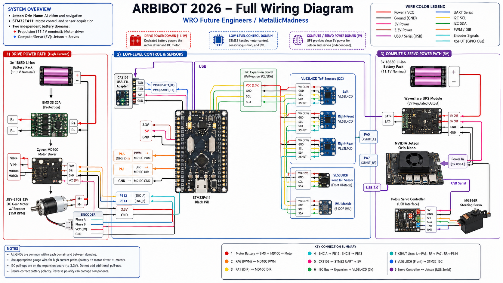

# Schemes

This folder contains the main engineering diagrams for the **MetallicMadness / ARBIBOT** WRO Future Engineers self-driving car project.

The purpose of this folder is to make the robot easier to understand, reproduce, debug, and evaluate. These diagrams show how the main electronic, power, sensor, and control subsystems are connected.

## Folder contents

| File | Description |
|---|---|
| `arbibot_2026_electronics_and_control_architecture.png` | High-level architecture diagram showing the Jetson AI/vision domain, STM32 low-level control domain, sensor bus, drive system, power domains, and sensor placement overview. |
| `full-wiring-diagram.png` | Complete wiring diagram showing batteries, BMS, UPS, Jetson, STM32, motor driver, motor encoder, servo controller, distance sensors, I2C expansion board, and communication lines. |
| `power-distribution-diagram.png` | Power architecture diagram showing the separated motor power path and electronics/Jetson power path, including batteries, BMS, UPS, voltage rails, current estimates, and safety notes. |
| `sensor-placement-diagram.png` | Sensor location diagram showing the physical placement and sensing purpose of the VL53L4CD sensors, VL53L8CH front matrix sensor, IMX477 camera, IMU, and motor encoder. |

## Diagram purpose

### Electronics and control architecture

The architecture diagram explains the overall system organization:

- NVIDIA Jetson Orin Nano for AI, camera processing, YOLO inference, and navigation decisions.
- STM32F411 Black Pill for low-level motor control, encoder reading, distance sensor acquisition, and real-time I/O.
- Cytron MD10C motor driver for the rear-wheel drive motor.
- Pololu servo controller for steering.
- VL53 time-of-flight sensors for wall following, obstacle distance, side correction, and front barrier detection.
- Separate motor and electronics power domains.

### Full wiring diagram

The full wiring diagram is the main reference for rebuilding the electrical system. It shows:

- battery connections,
- BMS and UPS wiring,
- motor driver wiring,
- STM32 pin connections,
- UART/USB serial communication,
- I2C sensor wiring,
- XSHUT control lines,
- encoder feedback,
- servo controller wiring,
- and common ground requirements.

### Power distribution diagram

The power distribution diagram explains how power flows through the robot. It documents the separation between:

1. **Drive power domain**  
   High-current path for the motor battery, BMS, Cytron MD10C, and DC gear motor.

2. **Electronics / compute power domain**  
   Regulated power path for the Jetson Orin Nano, camera, Pololu servo controller, and low-current electronics.

This separation reduces the risk of voltage drops, brownouts, sensor instability, UART errors, and resets caused by motor current spikes.

### Sensor placement diagram

The sensor placement diagram documents where the sensors are mounted on the robot and why they are positioned there.

Main sensor roles:

- **Front-center VL53L8CH**: front matrix distance sensor for obstacle and front-barrier detection.
- **Left VL53L4CD**: left/front distance sensing.
- **Right-front VL53L4CD**: right wall distance sensing.
- **Right-rear VL53L4CD**: heading correction by comparing front and rear right-side distances.
- **IMX477 camera**: red/green pillar detection, line/corner detection, and visual navigation.
- **Motor encoder**: wheel odometry and motor feedback.

## Naming convention

Diagram files should use lowercase names with hyphens where possible.

Recommended final names:

```text
arbibot_2026_electronics_and_control_architecture.png
full-wiring-diagram.png
power-distribution-diagram.png
sensor-placement-diagram.png
```

If source or editable versions are added later, place them in this same folder using a clear suffix:

```text
full-wiring-diagram.drawio
power-distribution-diagram.svg
sensor-placement-diagram-editable.pptx
```

## How these diagrams relate to the documentation

These diagrams are referenced from:

```text
README.md
engineering-journal/engineering-journal.md
docs/02-power-and-sensor-architecture.md
docs/03-software-architecture.md
docs/04-obstacle-strategy.md
```

Example Markdown reference from a file inside `docs/`:

```markdown

```

Example Markdown reference from the root `README.md`:

```markdown

```

Example Markdown reference from `engineering-journal/engineering-journal.md`:

```markdown

```

## Update policy

When the robot wiring or sensor placement changes, update the relevant diagram immediately. The diagrams should match the actual robot hardware used for testing and competition.

Recommended update order:

1. Update the physical robot wiring or sensor placement.
2. Update the matching diagram in this folder.
3. Update the related documentation in `docs/` or `engineering-journal/`.
4. Commit all related changes together.

## Notes

- All grounds must share a valid common reference where required by signal communication.
- High-current motor wiring should be physically separated from sensitive UART and I2C wiring where possible.
- The final competition wiring should be verified against `full-wiring-diagram.png`.
- The final power design should be verified against `power-distribution-diagram.png`.
- The final physical sensor positions should be verified against `sensor-placement-diagram.png`.
