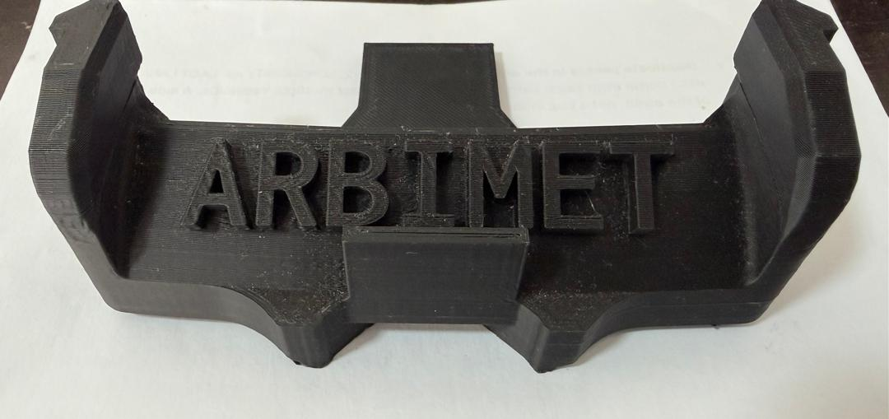

# Vehicle Photos

This folder contains real photos of the **MetallicMadness / ARBIBOT** WRO Future Engineers self-driving car.

The purpose of this folder is to provide visual evidence of the final robot design, including the chassis, bumper, sensor layout, steering system, electronics placement, and overall vehicle geometry. These photos support the Engineering Journal, root README, and WRO documentation requirements.

## Folder contents

| File | Description |
|---|---|
| `car-back.png` | Rear view of ARBIBOT, showing the back side of the chassis and rear vehicle structure. |
| `car-left.png` | Left-side view of ARBIBOT, showing the side profile, chassis height, wheel layout, and sensor/electronics placement from the left side. |
| `car-right.png` | Right-side view of ARBIBOT, showing the side profile, wheelbase, right-side sensor placement, and internal component arrangement. |
| `car-top.png` | Top view of ARBIBOT, showing the overall component layout, chassis organization, electronics position, battery placement, and wiring distribution. |
| `front-bumper.jpeg` | Close-up image of the front bumper, showing the mounting area for the front, left, and right distance sensors. |

## Photo purpose

These photos are used to document the physical robot as built, not only the diagrams or CAD concept. They help judges and other teams understand how the robot is assembled and how the main components are positioned.

The photos provide evidence for:

- vehicle dimensions and layout,
- chassis design,
- front bumper design,
- sensor placement,
- wheel and axle arrangement,
- steering and drivetrain integration,
- electronics mounting,
- wiring organization,
- and reproducibility of the mechanical design.

## Recommended documentation usage

These photos should be referenced from:

```text
README.md
engineering-journal/engineering-journal.md
docs/01-mechanical-design.md
docs/02-power-and-sensor-architecture.md
```

Example Markdown reference from the root `README.md`:

```markdown

```

Example Markdown reference from a file inside `docs/`:

```markdown

```

Example Markdown reference from `engineering-journal/engineering-journal.md`:

```markdown

```

## Current photo coverage

| Required WRO-style view | Current file | Status |
|---|---|---|
| Front view | [TODO: add `car-front.png`] | Missing |
| Back view | `car-back.png` | Available |
| Left view | `car-left.png` | Available |
| Right view | `car-right.png` | Available |
| Top view | `car-top.png` | Available |
| Bottom view | [TODO: add `car-bottom.png`] | Missing |
| Sensor / bumper close-up | `front-bumper.jpeg` | Available |
| Steering close-up | [TODO: add or reference steering image] | Missing in this folder |
| Motor / encoder close-up | [TODO: add motor close-up] | Missing |
| Electronics / wiring close-up | [TODO: add wiring close-up] | Missing |

## Recommended additional photos

Before final WRO submission, add the following images if possible:

```text
car-front.png
car-bottom.png
steering-closeup.png
motor-encoder-closeup.png
jetson-mounted.png
stm32-mounted.png
battery-placement.png
wiring-layout.png
sensor-mounts-closeup.png
robot-on-track.png
```

These additional photos will make the documentation stronger and more reproducible.

## Naming convention

Use lowercase filenames with hyphens.

Recommended examples:

```text
car-front.png
car-back.png
car-left.png
car-right.png
car-top.png
car-bottom.png
front-bumper.jpeg
steering-closeup.png
motor-encoder-closeup.png
wiring-layout.png
```

Avoid spaces in filenames because they make Markdown links harder to manage.

## Image size note

Some images in this folder are high-resolution and may be large. High-quality photos are useful for judges, but very large images can make the repository slower to clone.

If needed, keep the original photos and also create optimized copies for documentation:

```text
car-top.png                 # original or high-quality version
car-top-optimized.jpg       # smaller version for README/journal display
```

A good target for documentation images is usually under 2-5 MB per image, while keeping enough detail to inspect the robot.

## Update policy

When the robot changes mechanically or electrically, update the photos that no longer match the current design.

Recommended update process:

1. Take new photos of the changed area.
2. Replace or add the new image in this folder.
3. Update this README.
4. Update any Markdown links in the root README, Engineering Journal, or docs.
5. Commit the photo update together with the related documentation update.

## Current status

The current folder includes back, left, right, top, and front-bumper photos. Front and bottom views should still be added to complete the full vehicle-photo set.
