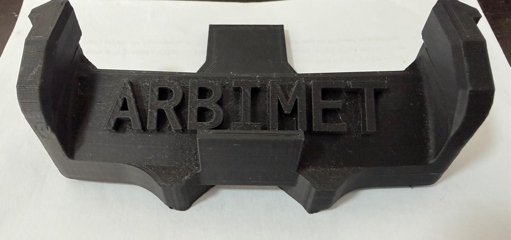
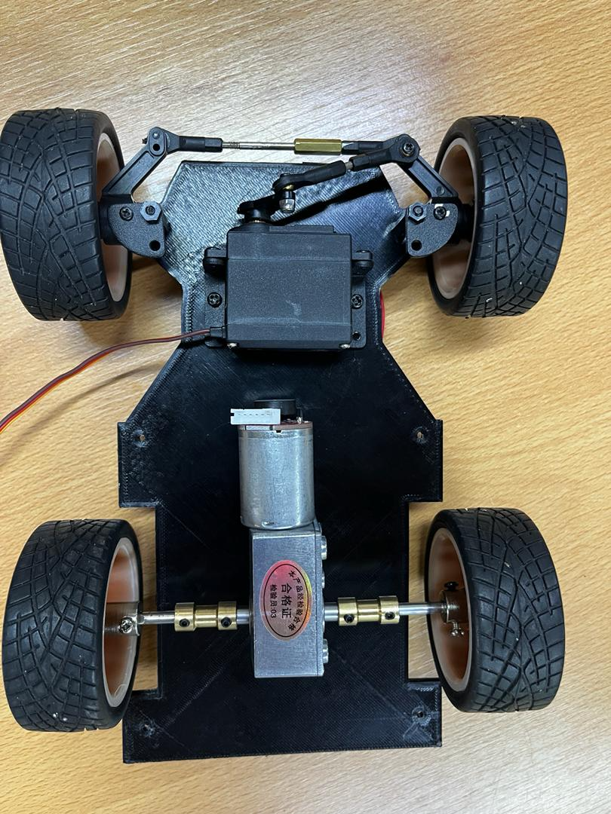
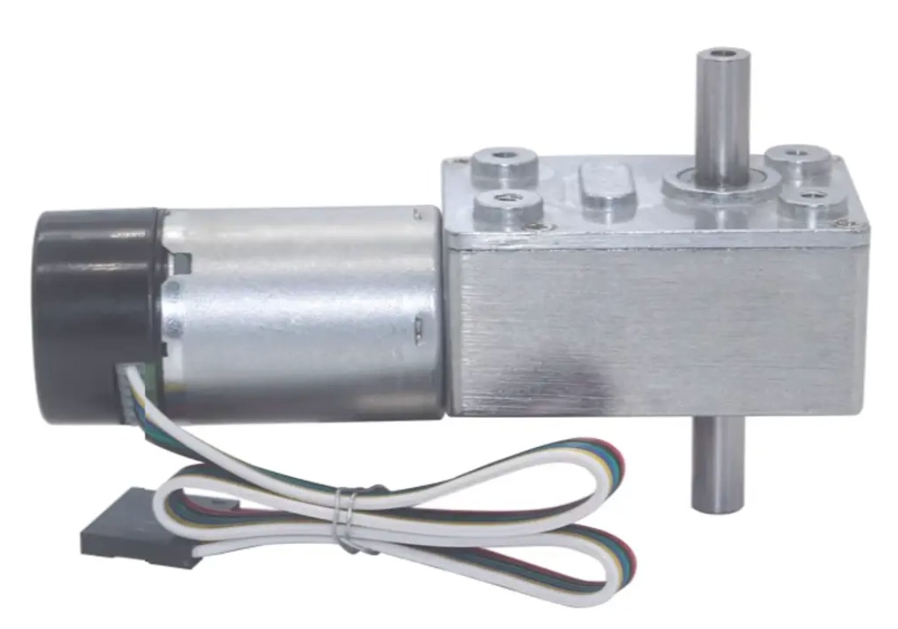

# Vehicle Photos

This folder contains the vehicle photo evidence for the **MetallicMadness / ARBIBOT** WRO 2026 Future Engineers project.

The images document the robot from all required external views and include additional close-up photos of important mechanical and sensor assemblies. These photos support the Engineering Journal and make the robot design easier to understand and reproduce.

---

## Photo Inventory

| File | View / Purpose | Description |
|---|---|---|
| `car-front.png` | Front view | Shows the front side of ARBIBOT, including the front bumper and front sensor area. |
| `car-back.png` | Rear view | Shows the rear side of the vehicle and the rear wheel arrangement. |
| `car-left.png` | Left side view | Shows the left side of the robot, chassis profile, wheel placement, and side clearance. |
| `car-right.png` | Right side view | Shows the right side of the robot, including the side where wall-following sensors are used. |
| `car-top.png` | Top view | Shows the general layout of the robot from above, including chassis footprint and component placement. |
| `car-bottom.png` | Bottom view | Shows the underside of the vehicle, including the chassis base, wheel layout, drive axle, motor position, and steering layout. |
| `front-bumper.png` | Front sensor close-up | Shows the front bumper and sensor mounting area. This image documents the front ToF sensor placement and bumper design. |
| `motor-stearing.png` | Motor and steering mechanism | Shows the robot chassis with the installed rear drive motor, rear axle, wheels, steering servo, steering linkage, and front wheel steering assembly. |
| `motor.png` | Motor component reference | Shows the JGY-370B worm gear DC motor with encoder used as the drive motor reference component. |

---

## Main Vehicle Views

The six main vehicle views are:

```text
car-front.png
car-back.png
car-left.png
car-right.png
car-top.png
car-bottom.png
```

Together, these images document the complete external shape of the robot and verify the physical layout used during testing.

---

## Mechanical Close-Ups

The additional mechanical close-up images are:

```text
front-bumper.png
motor-stearing.png
motor.png
```

These images are included because they document important engineering decisions:

- `front-bumper.png` shows the front sensor and bumper layout.
- `motor-stearing.png` shows the installed drive motor, rear axle, steering servo, and linkage system in the actual robot chassis.
- `motor.png` shows the motor component used for the drive system.

---

## Notes for the Engineering Journal

The Engineering Journal can reference these files when describing:

- Vehicle dimensions and chassis layout.
- Rear-wheel drive motor installation.
- Steering servo and linkage design.
- Sensor placement and front bumper design.
- Mechanical iteration and reproducibility.

Recommended image references:

```markdown







```

---

## File Format

All images in this folder are stored as `.png` files for consistent GitHub rendering and stable references from the Engineering Journal.

---

## Update Policy

When the vehicle design changes, update this folder with new photos and update this README if:

- A new sensor is added or moved.
- The steering linkage changes.
- The motor or drivetrain changes.
- The chassis geometry changes.
- A clearer close-up image becomes available.
- A filename changes.

Do not remove older photos if they document an important design iteration unless the Engineering Journal no longer references them.
